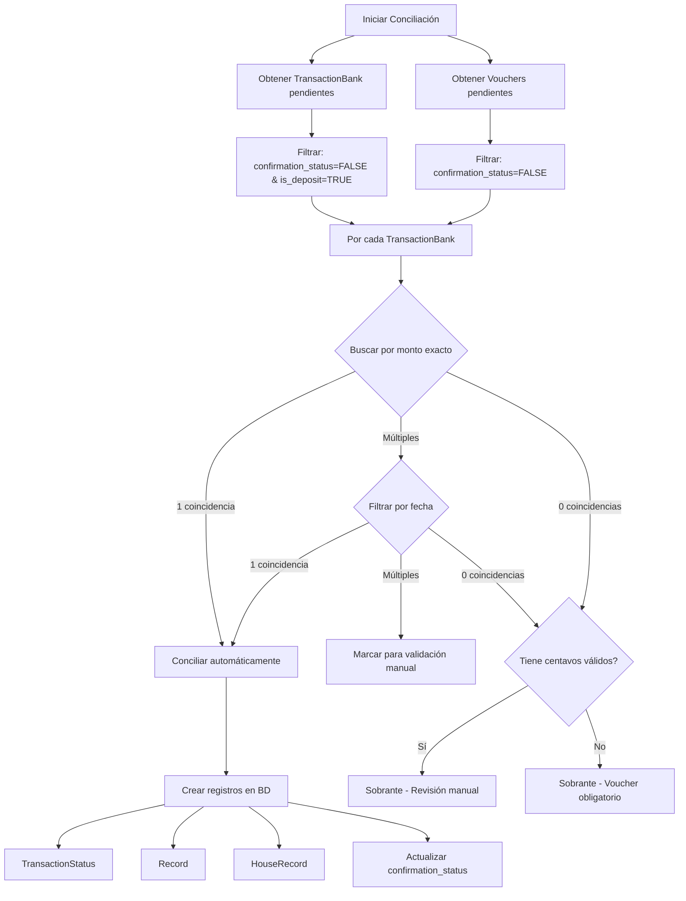

# Bank Reconciliation Feature

## Overview

El módulo de conciliación bancaria permite comparar automáticamente los vouchers subidos por usuarios contra los movimientos bancarios reales procesados, generando tres grupos de resultados: conciliados, pendientes y sobrantes. Este proceso asegura la integridad de los pagos recibidos y facilita la gestión administrativa.

## Architecture

### Clean Architecture Pattern

```
src/features/bank-reconciliation/
├── application/                          # Application Layer
│   ├── reconcile.use-case.ts            # Use Case: Orchestrate reconciliation
│   └── reconcile.use-case.spec.ts       # Unit tests
├── domain/                               # Domain Layer
│   ├── reconciliation.entity.ts         # Domain entities and value objects
│   ├── reconciliation.entity.spec.ts    # Unit tests
│   └── index.ts
├── infrastructure/                       # Infrastructure Layer
│   ├── matching/
│   │   ├── matching.service.ts          # Matching algorithm
│   │   └── matching.service.spec.ts     # Unit tests
│   └── persistence/
│       ├── reconciliation-data.service.ts          # Data retrieval
│       ├── reconciliation-data.service.spec.ts     # Unit tests
│       └── reconciliation-persistence.service.ts   # Database operations
├── controllers/                          # Presentation Layer
│   └── bank-reconciliation.controller.ts
├── dto/                                  # Data Transfer Objects
│   ├── reconcile-request.dto.ts
│   ├── reconciliation-response.dto.ts
│   └── index.ts
├── interfaces/                           # Type definitions (re-exports from domain)
│   └── reconciliation.interface.ts
├── config/                               # Feature configuration
│   └── reconciliation.config.ts
├── bank-reconciliation.module.ts        # NestJS Module
└── README.md                            # Quick reference (points to docs/)
```

### Clean Architecture Layers

#### 1. Domain Layer (`domain/`)
Entidades de negocio puras, sin dependencias externas:
- `ReconciliationMatch`: Resultado de conciliación exitosa
- `PendingVoucher`: Voucher sin conciliar
- `SurplusTransaction`: Transacción sin voucher
- `ManualValidationCase`: Caso requiere revisión manual
- `ReconciliationSummary`: Resumen de resultados

#### 2. Application Layer (`application/`)
Casos de uso que orquestan la lógica de negocio:
- `ReconcileUseCase`: Ejecuta proceso completo de conciliación

#### 3. Infrastructure Layer (`infrastructure/`)
Implementaciones concretas de servicios:
- **Matching**: `MatchingService` - Algoritmo de coincidencias
- **Persistence**:
  - `ReconciliationDataService` - Obtención de datos
  - `ReconciliationPersistenceService` - Operaciones de BD

#### 4. Presentation Layer (`controllers/`)
Exposición de funcionalidad vía REST API:
- `BankReconciliationController` - Endpoints HTTP

### Dependencies Flow

```
Controllers → Use Cases → Domain ← Infrastructure
                ↓
          Shared Utils
```

**Reglas**:
- Domain NO depende de nada
- Application depende de Domain
- Infrastructure depende de Domain
- Controllers dependen de Application

## Core Features

### 1. Conciliación Automática

El sistema procesa transacciones bancarias y vouchers pendientes, aplicando criterios de matching en orden de prioridad:

1. **Monto Exacto**: Coincidencia de montos (tolerancia < $0.01)
2. **Fecha/Hora**: Filtrado por fecha cercana (±36 horas configurable)
3. **Concepto**: TODO - Validación con IA (próxima implementación)

### 2. Identificación de Casa

**Por Centavos del Monto**:
- Los centavos del monto indican el número de casa
- Ejemplo: `$500.15` → Casa #15
- Rango válido: 1-66 (configurable)

**Requisitos**:
- Si monto = `$500.00` (sin centavos), **voucher obligatorio**
- Casa debe existir en la base de datos

### 3. Tres Grupos de Resultados

#### ✅ Conciliados
Vouchers que coinciden con movimientos bancarios.

**Criterios de conciliación automática**:
- Monto exacto + única coincidencia
- Monto exacto + fecha cercana + única coincidencia
- Nivel de confianza HIGH o MEDIUM

**Acciones automáticas**:
- Crear `TransactionStatus` con `validation_status = CONFIRMED`
- Asociar o reutilizar `Record` existente del voucher
- Crear `HouseRecord` vinculando casa
- Actualizar `confirmation_status = TRUE` en ambas tablas

#### ⏳ Pendientes
Vouchers sin coincidencia con movimientos bancarios.

**Razones comunes**:
- Pago aún no reflejado en banco
- Error en monto o fecha del voucher
- Pago realizado a cuenta incorrecta

**Seguimiento**:
- Se re-evalúan en futuras conciliaciones
- Mantienen `confirmation_status = FALSE`

#### 📊 Sobrantes
Movimientos bancarios sin voucher asociado.

**Tipos de sobrantes**:
1. **Con centavos válidos**: Casa identificable, requiere revisión manual
2. **Sin centavos**: No identificable, requiere voucher obligatorio
3. **Múltiples coincidencias**: Requiere validación manual

### 4. Niveles de Confianza

```typescript
enum ConfidenceLevel {
  HIGH = 'high',       // Monto + fecha cercana + voucher único
  MEDIUM = 'medium',   // Monto exacto pero múltiples candidatos
  LOW = 'low',         // Solo identificado por centavos sin voucher
  MANUAL = 'manual'    // Requiere revisión humana
}
```

### 5. Validación Manual

Casos que requieren intervención manual:
- Múltiples vouchers con mismo monto y fechas similares
- Transacciones sin centavos identificables y sin voucher
- Sobrantes con centavos válidos pero sin voucher

## API Endpoints

### Execute Reconciliation

```http
POST /bank-reconciliation/reconcile
Content-Type: application/json

{
  "startDate": "2025-01-01",  // Opcional
  "endDate": "2025-01-31"     // Opcional
}
```

**Parámetros**:
- `startDate` (opcional): Fecha inicio del rango a conciliar
- `endDate` (opcional): Fecha fin del rango a conciliar
- Sin parámetros: Procesa TODOS los registros pendientes

**Response**:
```json
{
  "summary": {
    "totalProcessed": 100,
    "conciliados": 75,
    "pendientes": 15,
    "sobrantes": 10,
    "requiresManualValidation": 20
  },
  "conciliados": [
    {
      "transactionBankId": "123",
      "voucherId": 456,
      "houseNumber": 15,
      "amount": 500.15,
      "matchCriteria": ["amount", "date"],
      "confidenceLevel": "high",
      "dateDifferenceHours": 0.5
    }
  ],
  "pendientes": [
    {
      "voucherId": 789,
      "amount": 300.25,
      "date": "2025-01-10T10:00:00.000Z",
      "reason": "No matching transaction found"
    }
  ],
  "sobrantes": [
    {
      "transactionBankId": "999",
      "amount": 600.00,
      "date": "2025-01-12T15:30:00.000Z",
      "reason": "No voucher found, no cents to identify house",
      "requiresManualReview": true
    }
  ],
  "manualValidationRequired": [
    {
      "transactionBankId": "888",
      "possibleMatches": [
        {
          "voucherId": 111,
          "similarity": 0.85,
          "dateDifferenceHours": 12
        },
        {
          "voucherId": 222,
          "similarity": 0.82,
          "dateDifferenceHours": 18
        }
      ],
      "reason": "Multiple vouchers with same amount"
    }
  ]
}
```

## Business Logic

### Reconciliation Flow



### Matching Algorithm

#### Paso 1: Búsqueda por Monto

```typescript
// Filtrar vouchers con monto exacto (tolerancia < $0.01)
const amountMatches = vouchers.filter(v =>
  Math.abs(v.amount - transaction.amount) < 0.01 &&
  !processedVoucherIds.has(v.id)
);
```

**Resultado**:
- **1 coincidencia**: Proceder a validar fecha → Conciliar automáticamente
- **Múltiples**: Ir a Paso 2
- **0**: Ir a Paso 3

#### Paso 2: Filtrado por Fecha

```typescript
const dateFilteredMatches = amountMatches
  .map(v => ({
    voucher: v,
    dateDiff: calculateHoursDifference(transaction, v)
  }))
  .filter(m => m.dateDiff <= 36) // Tolerancia configurable
  .sort((a, b) => a.dateDiff - b.dateDiff); // Más cercana primero
```

**Resultado**:
- **1 coincidencia**: Conciliar con voucher más cercano
- **Múltiples**: Marcar para validación manual
- **0**: Ir a Paso 3

#### Paso 3: Identificación por Centavos

```typescript
const houseNumber = extractCentsAsHouseNumber(transaction.amount);
// $500.15 → 15

if (houseNumber >= 1 && houseNumber <= 66) {
  // Verificar que casa exista
  if (houseExists(houseNumber)) {
    // Marcar como sobrante con revisión manual
  }
} else {
  // Sin centavos válidos, voucher obligatorio
}
```

### Database Updates

Cuando se concilia exitosamente:

```typescript
// Transacción completa con rollback automático en caso de error
await transaction(() => {
  // 1. Crear TransactionStatus
  const txStatus = await createTransactionStatus({
    validation_status: 'CONFIRMED',
    transactions_bank_id: transactionBankId,
    vouchers_id: voucherId
  });

  // 2. Reutilizar Record existente o crear nuevo
  const record = voucher.hasRecord
    ? voucher.existingRecord
    : await createRecord({
        vouchers_id: voucherId,
        transaction_status_id: txStatus.id
      });

  // 3. Crear HouseRecord
  await createHouseRecord({
    house_id: house.id,
    record_id: record.id
  });

  // 4. Actualizar confirmation_status
  await updateTransactionBank(transactionBankId, {
    confirmation_status: true
  });
  await updateVoucher(voucherId, {
    confirmation_status: true
  });
});
```

## Data Models

### ReconciliationMatch
```typescript
interface ReconciliationMatch {
  transactionBankId: string;
  voucherId?: number;
  houseNumber: number;
  amount: number;
  matchCriteria: MatchCriteria[];
  confidenceLevel: ConfidenceLevel;
  dateDifferenceHours?: number;
}
```

### PendingVoucher
```typescript
interface PendingVoucher {
  voucherId: number;
  amount: number;
  date: Date;
  reason: string;
}
```

### SurplusTransaction
```typescript
interface SurplusTransaction {
  transactionBankId: string;
  amount: number;
  date: Date;
  reason: string;
  requiresManualReview: boolean;
}
```

### ManualValidationCase
```typescript
interface ManualValidationCase {
  transactionBankId: string;
  possibleMatches: Array<{
    voucherId: number;
    similarity: number;
    dateDifferenceHours: number;
  }>;
  reason: string;
}
```

## Configuration

### Reconciliation Config

**Ubicación**: `src/features/bank-reconciliation/config/reconciliation.config.ts`

**IMPORTANTE**: Estos valores NO están en variables de entorno. Son configuraciones específicas del feature.

```typescript
export const ReconciliationConfig = {
  // Tolerancia de fecha/hora en horas
  // Permite hasta ±36 horas de diferencia
  DATE_TOLERANCE_HOURS: 36,

  // Tolerancia de tiempo en minutos
  TIME_TOLERANCE_MINUTES: 30,

  // Requiere voucher cuando no hay centavos identificables
  REQUIRE_VOUCHER_FOR_NO_CENTS: true,

  // Número máximo de casas en el proyecto
  MAX_HOUSE_NUMBER: 66,

  // Umbral de similitud para matches automáticos
  AUTO_MATCH_SIMILARITY_THRESHOLD: 0.95,

  // Habilitar matching por concepto con IA
  ENABLE_CONCEPT_MATCHING: false,  // TODO: Implementar
};
```

### Customization

Para modificar configuración:

```typescript
// Cambiar tolerancia de fecha
ReconciliationConfig.DATE_TOLERANCE_HOURS = 48; // ±2 días

// Cambiar número máximo de casas
ReconciliationConfig.MAX_HOUSE_NUMBER = 100;

// Habilitar matching por concepto (cuando esté implementado)
ReconciliationConfig.ENABLE_CONCEPT_MATCHING = true;
```

## Business Rules

### Rule 1: Solo Depósitos Pendientes

```typescript
// Solo se procesan transacciones que cumplan:
confirmation_status === false && is_deposit === true
```

**Razón**: Solo interesa conciliar pagos recibidos (depósitos), no retiros.

### Rule 2: Vouchers No Conciliados

```typescript
// Solo se procesan vouchers con:
confirmation_status === false
```

**Razón**: Evitar re-procesar vouchers ya validados.

### Rule 3: Identificación de Casa Obligatoria

```typescript
if (amount % 1 === 0) { // Sin centavos
  // Voucher obligatorio
  if (!hasMatchingVoucher) {
    return SURPLUS_REQUIRES_VOUCHER;
  }
}
```

**Razón**: Sin centavos no hay forma automática de identificar la casa.

### Rule 4: Re-utilización de Records

```typescript
// Si el voucher ya tiene un record asociado
if (voucher.records.length > 0) {
  // Usar el existente, NO crear uno nuevo
  record = voucher.records[0];
}
```

**Razón**: Evitar duplicación de registros en la tabla `records`.

### Rule 5: Transacciones Ya Conciliadas se Ignoran

```typescript
// Las siguientes NO se procesan:
confirmation_status === true
```

**Razón**: No re-procesar transacciones ya validadas en conciliaciones anteriores.

## Error Handling

### Validation Errors

```json
{
  "statusCode": 400,
  "message": "Invalid date range",
  "error": "Bad Request"
}
```

### Database Errors

Si falla alguna parte del proceso de conciliación:

```typescript
try {
  await reconcileTransaction();
} catch (error) {
  // Rollback automático de toda la transacción
  logger.error('Conciliación fallida, rollback ejecutado');
  throw error;
}
```

**Características**:
- Rollback automático de transacciones
- Logs detallados de errores
- Estado consistente garantizado

### Common Errors

**Error**: Casa no encontrada
```typescript
throw new Error(`Casa con número ${houseNumber} no encontrada`);
```

**Solución**: Verificar que la casa existe en la tabla `houses`

---

**Error**: Voucher sin records cuando se esperaba uno
```typescript
// El sistema maneja esto creando un nuevo record
```

**Solución**: Automático, el sistema crea el record faltante

## Performance Considerations

### Optimizations

1. **Batch Processing**:
   - Procesa múltiples transacciones en una sola ejecución
   - Reduce overhead de conexiones a BD

2. **Filtered Queries**:
   - Solo carga registros pendientes (`confirmation_status = FALSE`)
   - Reduce memoria y tiempo de procesamiento

3. **Index Usage**:
   - Queries optimizados con índices en:
     - `confirmation_status`
     - `is_deposit`
     - `amount`
     - `date`

4. **Transaction Management**:
   - Transacciones de BD por registro individual
   - Permite continuar si un registro falla
   - Mantiene consistencia de datos

### Scalability

**Registros por Ejecución**: Recomendado < 1000 transacciones

**Para volúmenes mayores**:
- Usar parámetros `startDate` y `endDate`
- Dividir en rangos de fechas menores
- Ejecutar conciliaciones periódicas (ej: semanales)

## Monitoring & Logging

### Log Levels

```typescript
// Info: Inicio y fin de conciliación
logger.log('Iniciando proceso de conciliación bancaria...');
logger.log(`Conciliados: ${conciliados.length}`);

// Error: Fallos en conciliación
logger.error('Error al crear registros de conciliación', errorStack);

// Debug: Detalles de matching
logger.log(`Usando record existente ID: ${recordId} para voucher ID: ${voucherId}`);
```

### Metrics to Monitor

1. **Tasa de Conciliación**:
   ```
   (conciliados / totalProcessed) * 100
   ```

2. **Tasa de Validación Manual**:
   ```
   (manualValidationRequired / totalProcessed) * 100
   ```

3. **Tiempo de Procesamiento**:
   - Objetivo: < 5 segundos para 100 transacciones

4. **Tasa de Errores**:
   - Objetivo: < 1% de transacciones con error

## Testing Strategy

### Unit Tests

```bash
# Todos los tests del feature
npm run test -- bank-reconciliation

# Solo domain entities
npm test -- reconciliation.entity.spec.ts

# Solo matching service
npm test -- matching.service.spec.ts

# Solo use case
npm test -- reconcile.use-case.spec.ts

# Solo data service
npm test -- reconciliation-data.service.spec.ts

# Shared utilities (date calculator)
npm test -- date-calculator.util.spec.ts
```

**Test Coverage Summary**:
- ✅ **Domain Entities** (15 tests)
  - ReconciliationMatch factory methods and business logic
  - PendingVoucher creation
  - SurplusTransaction creation
  - ManualValidationCase with multiple matches
  - ReconciliationSummary calculations

- ✅ **Infrastructure - MatchingService** (15 tests)
  - Single match by exact amount
  - Multiple matches with date filtering
  - Surplus transactions (with and without house numbers)
  - Amount matching precision (< $0.01 tolerance)
  - Edge cases (empty vouchers, processed vouchers)

- ✅ **Infrastructure - ReconciliationDataService** (12 tests)
  - getPendingTransactions with filters
  - getPendingVouchers with filters
  - Date range filtering
  - Business rules validation

- ✅ **Application - ReconcileUseCase** (9 tests)
  - Successfully reconcile matched transactions
  - Handle surplus transactions
  - Handle pending vouchers without matches
  - Handle manual validation cases
  - Handle persistence errors with rollback
  - Date range parameter passing
  - Mixed results scenario (conciliados + pendientes + sobrantes + manual)
  - Empty data handling

- ✅ **Shared Utils - Date Calculator** (34 tests)
  - getDateDifferenceInHours with various date formats
  - extractHouseNumberFromCents with various amounts
  - Realistic reconciliation scenarios
  - Boundary conditions and edge cases

**Total Test Count**: 85+ tests
**Test Files**: 5 spec files

### Integration Tests

```bash
npm run test:e2e -- bank-reconciliation
```

**Scenarios** (TODO - To be implemented):
- Conciliación exitosa con monto único
- Múltiples coincidencias → validación manual
- Sin coincidencias → sobrantes
- Reutilización de records existentes
- Rollback en caso de error
- End-to-end flow con base de datos real

### Test Data Examples

```typescript
// Domain Entity Test - ReconciliationMatch
const mockTransaction = {
  id: '123',
  amount: 500.15,
  date: new Date('2025-01-10'),
  time: '10:00:00',
  is_deposit: true,
  confirmation_status: false,
} as TransactionBank;

const mockVoucher = {
  id: 456,
  amount: 500.15,
  date: new Date('2025-01-10T10:05:00'),
  confirmation_status: false,
} as Voucher;

const match = ReconciliationMatch.create({
  transaction: mockTransaction,
  voucher: mockVoucher,
  houseNumber: 15,
  matchCriteria: [MatchCriteria.AMOUNT, MatchCriteria.DATE],
  confidenceLevel: ConfidenceLevel.HIGH,
  dateDifferenceHours: 0.08,
});

// Expected result
expect(match.transactionBankId).toBe('123');
expect(match.voucherId).toBe(456);
expect(match.hasVoucher()).toBe(true);
expect(match.isHighConfidence()).toBe(true);
```

### Test Configuration

**Jest Module Mapper** - Configurado en `package.json`:
```json
{
  "jest": {
    "moduleNameMapper": {
      "^@/(.*)$": "<rootDir>/$1"
    }
  }
}
```

Esto permite importaciones con alias `@/` en los tests, manteniendo consistencia con el código de producción.

## Future Enhancements (TODOs)

### 1. Validación por Concepto con IA

**Archivo**: `services/bank-reconciliation.service.ts:330`

**Objetivo**: Usar servicios de IA (OpenAI, Vertex AI, Gemini) para analizar el concepto de la transacción y extraer palabras clave que identifiquen la casa.

**Ejemplo**:
```typescript
// Concepto: "Pago mantenimiento Casa 15 - Enero"
// IA extrae: houseNumber = 15
```

**Servicios a integrar**:
- `@/shared/libs/openai`
- `@/shared/libs/vertex-ai`
- `@/shared/libs/google-cloud` (Gemini)

### 2. Eliminación Automática de Archivos del Bucket

**Archivo**: `services/bank-reconciliation.service.ts:370`

**Objetivo**: Cuando un voucher se concilia (`confirmation_status = TRUE`):
1. Eliminar archivo imagen del bucket de Google Cloud Storage
2. Marcar campo `url` como `null`

**Implementación**:
```typescript
import { CloudStorageService } from '@/shared/libs/google-cloud/storage';

// Al conciliar voucher
if (voucher.url) {
  await cloudStorageService.deleteFile(voucher.url);
  await updateVoucher(voucherId, { url: null });
}
```

### 3. Endpoints de Validación Manual

**Ubicación**: `controllers/bank-reconciliation.controller.ts`

**Endpoints a crear**:

```typescript
// Obtener casos pendientes de validación manual
GET /bank-reconciliation/pending-validation

// Aprobar una conciliación sugerida
POST /bank-reconciliation/manual-approve
{
  "transactionBankId": "123",
  "voucherId": 456,
  "houseNumber": 15
}

// Rechazar y marcar para revisión
POST /bank-reconciliation/manual-reject
{
  "transactionBankId": "123",
  "reason": "Monto incorrecto"
}
```

### 4. Eliminación de Vouchers No Conciliables

**Objetivo**: Permitir a un administrador eliminar vouchers que:
- Llevan más de X días sin conciliar
- Fueron marcados como erróneos
- No corresponden a pagos válidos

**Implementación sugerida**:
```typescript
POST /bank-reconciliation/delete-voucher
{
  "voucherId": 789,
  "reason": "Pago duplicado, no válido"
}
```

### 5. Tabla de Auditoría

**Nueva entidad**: `BankReconciliationLog`

**Schema**:
```typescript
{
  id: number;
  execution_date: Date;
  user_id: string;
  total_processed: number;
  conciliados: number;
  pendientes: number;
  sobrantes: number;
  requires_manual: number;
  execution_time_ms: number;
  date_range_start?: Date;
  date_range_end?: Date;
}
```

**Beneficios**:
- Rastrear histórico de conciliaciones
- Identificar patrones y errores
- Auditoría completa del proceso

### 6. Notificaciones

**Casos de uso**:
- Alto porcentaje de validación manual
- Errores durante conciliación
- Conciliación completada exitosamente

**Implementación**:
```typescript
// Email (futuro)
await emailService.send({
  to: 'admin@example.com',
  subject: '20 casos requieren validación manual',
  body: emailTemplate
});

// Dashboard interno (prioritario)
// Ya implementado en el response del endpoint
```

## Related Documentation

### Features
- [Transactions Bank](../transactions-bank/README.md) - Procesamiento de extractos bancarios
- [Vouchers](../../modules/vouchers/README.md) - Sistema de comprobantes OCR

### Database
- [Schema](../../database/schema.md) - Estructura de tablas
- [Triggers](../../database/triggers.md) - Triggers SQL

### Modules
- [Google Cloud](../../modules/google-cloud/README.md) - Servicios GCP
- [Content System](../../modules/content/README.md) - Sistema de mensajes

## Support & Troubleshooting

### Common Issues

**Problema**: Voucher con monto exacto pero no concilia

**Solución**:
1. Verificar que `confirmation_status = FALSE` en ambas tablas
2. Verificar que `is_deposit = TRUE` en TransactionBank
3. Verificar que fecha esté dentro de tolerancia (±36 horas)
4. Revisar logs del servicio para más detalles

---

**Problema**: Casa no encontrada en conciliación

**Solución**:
1. Verificar que casa existe: `SELECT * FROM houses WHERE number_house = X`
2. Verificar que centavos corresponden a número válido (1-66)
3. Si casa no existe, crearla antes de ejecutar conciliación

---

**Problema**: Alta tasa de validación manual

**Solución**:
1. Revisar configuración de tolerancia de fecha
2. Aumentar `DATE_TOLERANCE_HOURS` si es apropiado
3. Revisar calidad de datos de vouchers
4. Considerar implementar validación por concepto con IA

## Change Log

### v1.0.0 - Initial Release (Octubre 2025)
- ✅ Conciliación automática por monto y fecha
- ✅ Identificación de casa por centavos
- ✅ Tres grupos de resultados (conciliados, pendientes, sobrantes)
- ✅ Niveles de confianza
- ✅ Endpoint de conciliación con rangos de fecha opcionales
- ✅ Configuración centralizada
- ✅ Transacciones con rollback automático
- ⏳ TODO: Validación por concepto con IA
- ⏳ TODO: Eliminación de archivos del bucket
- ⏳ TODO: Endpoints de validación manual
- ⏳ TODO: Tabla de auditoría

---

**Maintained by**: Equipo de Desarrollo Agave
**Last Updated**: Octubre 2025
**Version**: 1.0.0
