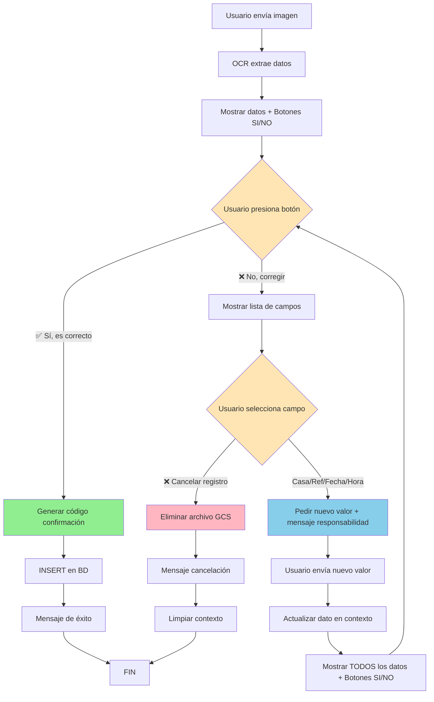

# Vouchers Feature

## Overview

El módulo de vouchers permite el procesamiento automatizado de comprobantes de pago mediante:
- **OCR (Reconocimiento Óptico de Caracteres)** con Google Cloud Vision API
- **Múltiples canales de recepción**: WhatsApp Business API, Telegram Bot API, HTTP uploads
- **Procesamiento inteligente con IA** (OpenAI/Vertex AI) para estructuración de datos
- **Gestión de conversaciones** con manejo de contexto y estados
- **Inserción automática en base de datos** con códigos de confirmación únicos

## Architecture

### Clean Architecture Pattern

```
src/features/vouchers/
├── controllers/           # HTTP endpoints y WhatsApp webhook
│   └── vouchers.controller.ts
├── services/             # Lógica de negocio principal
│   ├── vouchers.service.ts
│   ├── ocr.service.ts
│   ├── voucher-processor.service.ts
│   ├── whatsapp-media.service.ts
│   ├── whatsapp-message-classifier.service.ts
│   └── conversation-state.service.ts
├── dto/                  # Data Transfer Objects
│   ├── transaction.dto.ts
│   ├── process-file.dto.ts
│   └── ocr-service.dto.ts
├── interfaces/           # Contratos e interfaces TypeScript
│   └── transaction.interface.ts
└── vouchers.module.ts
```

### Key Components

#### 1. Controllers
- `VouchersController`:
  - Endpoints REST para OCR
  - WhatsApp webhook para mensajes
  - Gestión de confirmaciones y contexto

#### 2. Core Services
- `VoucherProcessorService`: Procesamiento unificado de vouchers (HTTP + WhatsApp)
- `OcrService`: Extracción de texto con Google Cloud Vision
- `ConversationStateService`: Manejo de estados de conversación
- `WhatsAppApiService`: Servicio genérico para peticiones HTTP a WhatsApp Business API
- `WhatsAppMessagingService`: Envío de mensajes (texto, botones, listas, imágenes, documentos)
- `WhatsAppMediaService`: Descarga de archivos multimedia desde WhatsApp
- `WhatsAppMessageClassifierService`: Clasificación de mensajes con IA

#### 3. Repository
- `VoucherRepository`: Acceso a datos con TypeORM

## Supported Formats

### File Types (OCR)
- **Images**: JPG, PNG, WEBP, GIF, BMP, TIFF
- **Documents**: PDF (multi-página)
- **Max Size**: 10MB

### Supported Languages
- Spanish (`es`) - Default
- English (`en`)
- Auto-detect

## Core Features

### 1. OCR Processing
```typescript
POST /vouchers/ocr-service
```

**Capabilities:**
- Extracción de texto desde imágenes/PDFs
- Upload a Google Cloud Storage
- Procesamiento con IA (OpenAI/Vertex AI)
- Extracción automática de:
  - Monto de pago
  - Fecha de pago
  - Referencia/Autorización
  - Hora de transacción
  - Número de casa (desde centavos)

**Regla de Negocio - Número de Casa:**
```
Monto: $1,500.15 → Casa: 15
Monto: $2,300.42 → Casa: 42
Monto: $1,000.00 → Casa: null (no detectada)
```

### 2. WhatsApp Integration

#### Webhook Verification
```http
GET /vouchers/whatsapp-webhook?hub.mode=subscribe&hub.verify_token=...
```

#### Message Processing
```http
POST /vouchers/whatsapp-webhook
```

**Message Types Handled:**
- `text`: Mensajes de texto (clasificación con IA)
- `image`: Comprobantes en imagen (OCR automático)
- `document`: PDFs de comprobantes (OCR automático)

**Message Classification:**
```typescript
enum MessageIntent {
  PAYMENT_VOUCHER = 'payment_voucher',  // Comprobante de pago
  GREETING = 'greeting',                // Saludo
  OFF_TOPIC = 'off_topic',             // Fuera de contexto
}
```

### 3. Telegram Integration

El módulo de vouchers ahora soporta recepción de comprobantes mediante Telegram Bot API.

#### Setup del Bot

1. **Crear Bot con BotFather**
   ```
   1. Abrir Telegram y buscar @BotFather
   2. Enviar comando /newbot
   3. Seguir instrucciones para nombre del bot
   4. Copiar el Bot Token proporcionado
   ```

2. **Configurar Variables de Entorno**
   ```bash
   # .env
   TELEGRAM_BOT_TOKEN=1234567890:ABCdefGHIjklMNOpqrsTUVwxyz
   TELEGRAM_WEBHOOK_URL=https://your-domain.com/vouchers/webhook/telegram
   ```

3. **Configurar Webhook** (ejecutar una vez después del deploy)
   ```bash
   # Usando TelegramApiService.setWebhook()
   # O manualmente:
   curl -X POST "https://api.telegram.org/bot<BOT_TOKEN>/setWebhook" \
     -d "url=https://your-domain.com/vouchers/webhook/telegram"
   ```

#### Endpoint del Webhook
```http
POST /vouchers/webhook/telegram
Content-Type: application/json

{
  "update_id": 123456789,
  "message": {
    "message_id": 1,
    "from": { "id": 123456, "username": "user123" },
    "chat": { "id": 123456, "type": "private" },
    "photo": [...],  // O document, text
    "date": 1634567890
  }
}
```

#### Tipos de Mensajes Soportados

- **Comandos**:
  - `/start` - Mensaje de bienvenida
  - `/ayuda` - Ayuda e instrucciones

- **Fotos**: Procesamiento automático con OCR (formato JPEG)

- **Documentos**: PDFs de comprobantes (hasta 20MB)

- **Botones Inline**: Confirmación de datos (✅ Sí / ❌ No)

#### Flujo de Conversación

1. Usuario envía foto o PDF del comprobante
2. Bot descarga archivo y procesa con OCR
3. Bot extrae datos y responde con solicitud de confirmación:
   ```
   ✅ Datos extraídos del comprobante:

   💰 Monto: $1,500.15
   📅 Fecha: 2024-10-03
   🏠 Casa: 15
   🔢 Referencia: REF123456
   ⏰ Hora: 14:30:45

   ¿Los datos son correctos?
   [✅ Sí, confirmar] [❌ No, corregir]
   ```

4. Usuario presiona botón inline para confirmar o corregir

#### Características de Telegram vs WhatsApp

| Aspecto | WhatsApp | Telegram |
|---------|----------|----------|
| Identificador | phoneNumber | chat_id |
| Botones | Interactive buttons | InlineKeyboardMarkup |
| Formato mensajes | WhatsApp formatting | Markdown/HTML |
| Límite archivos | 16MB | 20MB (descarga via bot) |
| Webhook | Requiere verificación | POST directo |

#### Arquitectura

**Servicios de Infraestructura:**
- `TelegramApiService` - Cliente de Telegram Bot API
- `TelegramMediaService` - Descarga de fotos y documentos
- `TelegramMessagingService` - Envío de mensajes con formato Markdown y botones inline

**Use Case:**
- `HandleTelegramWebhookUseCase` - Procesamiento de updates (mensajes, fotos, comandos, callbacks)

**Reutilización:**
- `VoucherProcessorService` - Compartido entre WhatsApp, Telegram, HTTP y Email
- `ConversationStateService` - Manejo de estado usando `chat_id` como identificador
- `VoucherValidator` - Validaciones de negocio compartidas

### 4. Conversation State Management

**Estados de Conversación:**
```typescript
enum ConversationState {
  IDLE = 'idle',                          // Sin conversación activa
  WAITING_CONFIRMATION = 'waiting_confirmation',  // Esperando "SI/NO" del usuario
  WAITING_HOUSE_NUMBER = 'waiting_house_number',  // Esperando número de casa
  WAITING_MISSING_DATA = 'waiting_missing_data',  // Esperando datos faltantes
  WAITING_CORRECTION_TYPE = 'waiting_correction_type',  // Esperando selección de campo a corregir
  WAITING_CORRECTION_VALUE = 'waiting_correction_value', // Esperando nuevo valor del campo
}
```

**Session Management:**
- Timeout: 10 minutos de inactividad
- Auto-cleanup: Cada 5 minutos
- Context storage: In-memory por número de teléfono

### 4. Database Insertion with Confirmation Code

**Formato del Código de Confirmación:**
```
YYYYMM-XXXXXXX

Ejemplos:
- 202410-A7K2M3P
- 202411-B9T4L8Q
- 202412-C3M7N2R
```

**Estructura:** Año (4) + Mes (2) + Guión + 7 caracteres aleatorios alfanuméricos

**Generación:** Solo al momento del INSERT en BD (después de confirmación del usuario)

## API Endpoints

### OCR Service

#### Upload and Process Voucher
```http
POST /vouchers/ocr-service
Content-Type: multipart/form-data

{
  "file": [imagen/PDF],
  "language": "es"  // opcional
}
```

**Response:**
```json
{
  "structuredData": {
    "monto": "1500.15",
    "fecha_pago": "2024-10-03",
    "referencia": "REF123456",
    "hora_transaccion": "14:30:45",
    "casa": 15,
    "faltan_datos": false
  },
  "originalFilename": "comprobante.jpg",
  "gcsFilename": "vouchers/2024-10-03/comprobante_1696348800000.jpg"
}
```

#### Get Supported Languages
```http
GET /vouchers/ocr-service/languages
```

**Response:**
```json
{
  "supported": ["es", "en"],
  "default": "es"
}
```

### Vouchers Management

#### Get All Vouchers
```http
GET /vouchers
```

**Query Parameters:**
- `confirmation_status` (optional): Filter by confirmation status
  - `true` - Vouchers confirmados (verificados en banco)
  - `false` - Vouchers pendientes (sin verificar)
- `startDate` (optional): Fecha inicial (formato: YYYY-MM-DD)
- `endDate` (optional): Fecha final (formato: YYYY-MM-DD)

**Examples:**
```bash
# Todos los vouchers
GET /vouchers

# Vouchers confirmados
GET /vouchers?confirmation_status=true

# Vouchers pendientes
GET /vouchers?confirmation_status=false

# Vouchers por rango de fechas
GET /vouchers?startDate=2024-01-01&endDate=2024-12-31

# Vouchers pendientes en octubre 2024
GET /vouchers?confirmation_status=false&startDate=2024-10-01&endDate=2024-10-31
```

**Response:**
```json
[
  {
    "id": 1,
    "date": "2024-10-03T00:00:00.000Z",
    "authorization_number": "REF123456",
    "confirmation_code": "202410-A7K2M3P",
    "amount": 1500.15,
    "confirmation_status": false,
    "url": "p-2024-10-03_14-30-45-abc123.jpg",
    "created_at": "2024-10-03T14:30:45.000Z",
    "updated_at": "2024-10-03T14:30:45.000Z"
  }
]
```

#### Get Voucher by ID

Obtiene un voucher específico por su ID y genera una URL firmada temporal para visualizar el archivo.

```http
GET /vouchers/:id
```

**Path Parameters:**
- `id` (required): ID del voucher en la base de datos

**Example:**
```bash
GET /vouchers/1
```

**Response:**
```json
{
  "id": 1,
  "date": "2024-10-03T00:00:00.000Z",
  "authorization_number": "REF123456",
  "confirmation_code": "202410-A7K2M3P",
  "amount": 1500.15,
  "confirmation_status": false,
  "url": "p-2024-10-03_14-30-45-abc123.jpg",
  "viewUrl": "https://storage.googleapis.com/bucket/p-2024-10-03_14-30-45-abc123.jpg?X-Goog-Algorithm=GOOG4-RSA-SHA256&X-Goog-Credential=...",
  "created_at": "2024-10-03T14:30:45.000Z",
  "updated_at": "2024-10-03T14:30:45.000Z"
}
```

**Campos de respuesta:**
- `url`: Nombre del archivo en Cloud Storage
- `viewUrl`: URL firmada temporal para visualizar el archivo (válida por 1 hora)
  - Si el voucher no tiene archivo asociado, `viewUrl` será `null`
  - La URL firmada expira después de 60 minutos
  - Permite visualizar archivos privados sin hacer público el bucket

**Notas:**
- La `viewUrl` es una URL firmada que permite acceso temporal al archivo
- No requiere autenticación adicional durante el período de validez
- Ideal para mostrar comprobantes en interfaces frontend
- Si no existe el archivo o falla la generación, `viewUrl` será `null` pero el endpoint retorna los datos del voucher

### WhatsApp Webhook

#### Webhook Verification (GET)
```http
GET /vouchers/whatsapp-webhook
  ?hub.mode=subscribe
  &hub.verify_token=YOUR_VERIFY_TOKEN
  &hub.challenge=CHALLENGE_STRING
```

**Response:** Returns `hub.challenge` value

#### Message Processing (POST)
```http
POST /vouchers/whatsapp-webhook
Content-Type: application/json

{
  "object": "whatsapp_business_account",
  "entry": [{
    "changes": [{
      "value": {
        "messages": [{
          "from": "521234567890",
          "type": "text",
          "text": { "body": "Hola" }
        }]
      }
    }]
  }]
}
```

**Response:**
```json
{
  "success": true
}
```

#### Interactive Message (Button Reply)
```json
{
  "object": "whatsapp_business_account",
  "entry": [{
    "changes": [{
      "value": {
        "messages": [{
          "from": "521234567890",
          "type": "interactive",
          "interactive": {
            "type": "button_reply",
            "button_reply": {
              "id": "confirm",
              "title": "✅ Sí, es correcto"
            }
          }
        }]
      }
    }]
  }]
}
```

**Supported Button IDs:**
- `confirm`: Usuario confirma datos como correctos
- `cancel`: Usuario cancela el registro

## Business Rules

### 1. Voucher Data Extraction

**Casos de Procesamiento:**

#### Caso 1: Datos Completos con Casa
```
Input: Imagen con monto $1,500.15
Output:
  - casa: 15 (extraída de centavos)
  - Mensaje: "Voy a registrar tu pago... Si los datos son correctos, escribe SI"
  - Estado: WAITING_CONFIRMATION
```

#### Caso 2: Datos Completos sin Casa
```
Input: Imagen con monto $1,500.00
Output:
  - casa: null
  - Mensaje: "Por favor indica el número de casa..."
  - Estado: WAITING_HOUSE_NUMBER
```

#### Caso 3: Faltan Datos
```
Input: Imagen ilegible o incompleta
Output:
  - faltan_datos: true
  - Mensaje: "No pude extraer los siguientes datos..."
  - Estado: WAITING_MISSING_DATA
```

### 2. Confirmation Flow

**Flujo Completo con Corrección de Datos:**
```
1. Usuario envía imagen
   ↓
2. OCR extrae datos
   ↓
3. Sistema muestra datos y pide confirmación con botones interactivos:
   - Botón 1: "✅ Sí, es correcto" (id: confirm)
   - Botón 2: "❌ No, corregir" (id: cancel)
   ↓
4a. Usuario presiona "✅ Sí, es correcto" (o escribe "SI")
    ↓
    Sistema genera código de confirmación (202410-A7K2M3P)
    ↓
    INSERT en BD con código
    ↓
    Mensaje de éxito con código de confirmación
    ↓
    FIN

4b. Usuario presiona "❌ No, corregir" (o escribe "NO")
    ↓
    Sistema muestra lista interactiva de campos a corregir:
    - Número de casa
    - Referencia
    - Fecha
    - Hora
    - ❌ Cancelar registro
    ↓
5. Usuario selecciona campo a corregir (ej: "Número de casa")
   ↓
6. Sistema pide nuevo valor con mensaje de responsabilidad:
   "⚠️ IMPORTANTE: Es tu responsabilidad proporcionar los datos correctos..."
   ↓
7. Usuario envía nuevo valor (ej: "15")
   ↓
8. Sistema actualiza el dato y muestra confirmación con TODOS los datos:
   "✅ Número de casa actualizado correctamente.

   Por favor, confirma que los siguientes datos son correctos:
   📍 Casa: 15
   💰 Monto: $1,500.00
   📅 Fecha: 2024-10-06
   🕒 Hora: 14:30:45
   🔢 Referencia: ABC123

   ¿Los datos son correctos?"
   - Botón 1: "✅ Sí, es correcto"
   - Botón 2: "❌ No, corregir"
   ↓
9. Volver al paso 4 (puede corregir "n" veces hasta confirmar)
   ↓
10. Cuando finalmente presiona "✅ Sí, es correcto"
    ↓
    INSERT en BD con código de confirmación
    ↓
    Mensaje de éxito
    ↓
    FIN

Alternativa en paso 5: Usuario selecciona "❌ Cancelar registro"
   ↓
   Sistema elimina archivo de Cloud Storage
   ↓
   Mensaje: "Entendido, he cancelado el registro..."
   ↓
   Context limpiado
   ↓
   FIN
```

**Diagrama Visual del Flujo de Corrección:**



**Estados de conversación en el flujo:**
1. `WAITING_CONFIRMATION` → Esperando SI/NO
2. `WAITING_CORRECTION_TYPE` → Esperando selección de campo (lista interactiva)
3. `WAITING_CORRECTION_VALUE` → Esperando texto con nuevo valor
4. Volver a `WAITING_CONFIRMATION` → Mostrar datos actualizados

**Características clave:**
- ✅ Usuario puede corregir datos **múltiples veces** hasta confirmar
- ✅ Mensaje de **responsabilidad** al pedir corrección
- ✅ Muestra **TODOS los datos** después de cada corrección
- ✅ Solo hace **INSERT en BD** cuando usuario confirma con SI
- ✅ Archivo se mantiene en GCS durante correcciones
- ✅ Archivo se elimina solo si usuario **cancela todo el registro**

### 3. Message Classification Priority

**Orden de Verificación:**
```
1. ¿Es tipo imagen/documento?
   → Sí: Procesar con OCR
   → No: Continuar

2. ¿Es tipo interactive (botones/listas)?
   → Sí: Extraer ID de respuesta (confirm/cancel)
   → Verificar contexto activo
   → Manejar según estado
   → No: Continuar

3. ¿Es tipo texto?
   → Verificar si hay contexto activo
   → Sí: Manejar según estado (confirmación, casa, datos faltantes)
   → No: Clasificar con IA y responder según intent
```

## Database Schema

### 🆕 Multi-Table Registration Flow

El sistema implementa un flujo transaccional que guarda información relacionada en múltiples tablas cuando se confirma un voucher:

```
vouchers → records → house_records → houses → users
```

#### Flujo de Registro Transaccional

**Implementado en:** `confirm-voucher.use-case.ts:50`

```typescript
// TRANSACCIÓN ACID (todo o nada)
1. ✅ Crear Voucher (vouchers table)
   - Generar código de confirmación único (YYYYMM-XXXXXXX)
   - confirmation_status = false (pendiente verificación en banco)

2. ✅ Buscar o Crear Usuario (users table)
   - Parsear cel_phone con código de país (formato E.164)
   - Si NO existe: crear con UUID v4, role=TENANT, status=ACTIVE

3. ✅ Crear Record (records table)
   - vouchers_id = voucher.id
   - transaction_status_id = null (se llenará con transactions-bank)
   - cta_* = null (se llenarán con transactions-bank)

4. ✅ Buscar o Crear Casa (houses table)
   - Buscar por number_house (ÚNICO)
   - Si NO existe: crear nueva casa
   - Si EXISTE y cambió propietario: actualizar user_id

5. ✅ Crear Asociación (house_records table)
   - Relacionar house_id con record_id
   - Permite múltiples pagos por casa
```

**Características Clave:**
- ✅ **Transacción ACID**: Todo se guarda o nada se guarda (QueryRunner)
- ✅ **Rollback automático** en caso de error
- ✅ **Número de casa obligatorio**: Si falta → Error y rechazo
- ✅ **Teléfono internacional**: Formato E.164 (cualquier código de país)
- ✅ **Usuario multi-casa**: Un usuario puede tener varias casas
- ✅ **Casa multi-pago**: Una casa puede tener múltiples records (pagos)
- ✅ **Cambio de propietario**: Casa puede cambiar de usuario sin perder historial

**Ver documentación completa:** [Database Integration](database-integration.md)

### Vouchers Table

```sql
CREATE TABLE vouchers (
  id BIGSERIAL PRIMARY KEY,
  image_url TEXT,
  amount FLOAT NOT NULL,
  date DATE,
  time TIME,
  casa INTEGER,  -- ⚠️ OBLIGATORIO para registro exitoso
  no_referencia VARCHAR(50),
  confirmation_code VARCHAR(20) UNIQUE,  -- Código único YYYYMM-XXXXXXX
  confirmation_status BOOLEAN DEFAULT false,
  created_at TIMESTAMP DEFAULT NOW(),
  updated_at TIMESTAMP DEFAULT NOW()
);

CREATE UNIQUE INDEX idx_voucher_confirmation_code
ON vouchers(confirmation_code);
CREATE INDEX idx_vouchers_casa ON vouchers(casa);
CREATE INDEX idx_vouchers_confirmation_status ON vouchers(confirmation_status);
```

### Related Tables

#### Users
```sql
CREATE TABLE users (
  id UUID PRIMARY KEY,
  cel_phone NUMERIC UNIQUE NOT NULL,  -- Formato E.164 (ej: 525512345678)
  role user_role NOT NULL DEFAULT 'tenant',
  status user_status NOT NULL DEFAULT 'active',
  created_at TIMESTAMP DEFAULT NOW(),
  updated_at TIMESTAMP DEFAULT NOW()
);
```

#### Houses
```sql
CREATE TABLE houses (
  id SERIAL PRIMARY KEY,                 -- PK autogenerada
  number_house INT UNIQUE NOT NULL,      -- Número único de casa
  user_id UUID REFERENCES users(id),     -- Propietario actual
  created_at TIMESTAMP DEFAULT NOW(),
  updated_at TIMESTAMP DEFAULT NOW()
);
```

#### Records
```sql
CREATE TABLE records (
  id SERIAL PRIMARY KEY,
  vouchers_id BIGINT REFERENCES vouchers(id) ON DELETE CASCADE,
  transaction_status_id INT,             -- null inicialmente
  cta_water_id INT,                      -- null inicialmente
  cta_maintenance_id INT,                -- null inicialmente
  cta_ordinary_fee_id INT,               -- null inicialmente
  cta_extraordinary_fee_id INT,          -- null inicialmente
  created_at TIMESTAMP DEFAULT NOW(),
  updated_at TIMESTAMP DEFAULT NOW()
);
```

#### House Records (Tabla Intermedia)
```sql
CREATE TABLE house_records (
  id SERIAL PRIMARY KEY,
  house_id INT REFERENCES houses(id) ON DELETE CASCADE,
  record_id INT REFERENCES records(id) ON DELETE CASCADE,
  created_at TIMESTAMP DEFAULT NOW(),
  updated_at TIMESTAMP DEFAULT NOW()
);

-- Permite múltiples pagos por casa
CREATE UNIQUE INDEX idx_house_records_unique ON house_records(house_id, record_id);
```

**Relaciones:**
```
users (1) ──→ (N) houses (1) ──→ (N) house_records (N) ──→ (1) records (1) ──→ (1) vouchers
```

**Ver esquema completo:** [Database Schema](../../database/schema.md)

## Message Templates

### WhatsApp Messages (Centralized)

**Success Message:**
```
¡Perfecto! Tu pago ha sido registrado exitosamente con el estatus
"pendiente verificación en banco".

Casa: 15
Monto: $1,500.15

🔐 Número de confirmación: 202410-A7K2M3P

Guarda este número para futuras consultas sobre tu pago.

Te notificaremos cuando sea verificado. ¡Gracias!
```

**Confirmation Request:**
```
Voy a registrar tu pago con el estatus "pendiente verificación en banco"
con los siguientes datos que he encontrado en el comprobante:
Monto de pago: $1,500.15
Fecha de Pago: 2024-10-03
Numero de Casa: 15
Referencia: REF123456
Hora de Transacción: 14:30:45

Si los datos son correctos, escribe SI
```

**Error Messages:**
```
- "El tipo de archivo no es soportado..."
- "Ha expirado la sesión. Por favor envía nuevamente el comprobante."
- "Hubo un error al registrar tu pago. Por favor intenta nuevamente..."
```

Ver: [Content Dictionary](../../modules/content/README.md)

## Configuration

### Environment Variables

```env
# Google Cloud Platform
GOOGLE_CLOUD_PROJECT_ID=your-project-id
GOOGLE_APPLICATION_CREDENTIALS=/path/to/credentials.json
PROJECT_ID_GCP=your-project-id

# WhatsApp Business API
WHATSAPP_API_TOKEN=your_whatsapp_token
PHONE_NUMBER_ID_WA=your_phone_number_id
VERIFY_TOKEN_WA=your_verify_token

# AI Services
OPENAI_API_KEY=your_openai_key
```

### Business Values (Centralized)

```typescript
// src/shared/content/config/business-values.config.ts

houses: {
  min: 1,
  max: 66
},

session: {
  timeoutMs: 10 * 60 * 1000,      // 10 minutos
  cleanupIntervalMs: 5 * 60 * 1000 // 5 minutos
},

files: {
  maxSizeBytes: 10 * 1024 * 1024  // 10MB
}
```

## Error Handling

### Common Errors

**1. Unsupported File Type**
```json
{
  "statusCode": 400,
  "message": "El tipo de archivo image/svg+xml no es soportado. Solo se permiten: image/jpeg, image/png, application/pdf"
}
```

**2. Session Expired**
```json
{
  "message": "Ha expirado la sesión. Por favor envía nuevamente el comprobante."
}
```

**3. Database Error**
```json
{
  "message": "Hubo un error al registrar tu pago. Por favor intenta nuevamente más tarde."
}
```

## Performance Considerations

### OCR Processing
- **Average Time**: 2-5 segundos por imagen
- **PDF Multi-page**: +1-2 segundos por página adicional
- **GCS Upload**: Asíncrono, no bloquea respuesta

### WhatsApp Webhook
- **Response Time**: < 1 segundo (requerido por Meta)
- **Processing**: Asíncrono después de respuesta 200 OK
- **Rate Limiting**: Aplicado por WhatsApp API

### Session Management
- **Storage**: In-memory (no persistente)
- **Cleanup**: Automático cada 5 minutos
- **Timeout**: 10 minutos sin actividad

## Integration Points

### Google Cloud Platform
- **Vision API**: OCR text extraction ([Setup Guide](../../modules/google-cloud/vision-api-setup.md))
- **Cloud Storage**: File uploads ([Service Documentation](../../modules/google-cloud/README.md#cloud-storage-service))
- **Translate API**: (Future) Multi-language support

### WhatsApp Business API
- **Version**: v23.0
- **Endpoints**:
  - Send messages: `/v23.0/{phone_number_id}/messages`
  - Download media: `/v23.0/{media_id}`
- **Interactive Messages**:
  - Reply Buttons (hasta 3 botones)
  - List Messages (hasta 10 opciones por sección)
  - Usados en confirmaciones SI/NO

#### WhatsApp Services Architecture

**WhatsAppApiService** (Base Layer):
```typescript
// Servicio genérico para peticiones HTTP a WhatsApp API
async request<T>(endpoint: string, method: 'GET' | 'POST' | 'DELETE', body?: any)
async sendMessage(payload: any)
async getMediaInfo(mediaId: string)
async downloadMedia(mediaUrl: string): Promise<Buffer>
```

**WhatsAppMessagingService** (Messaging Layer):
```typescript
// Servicios especializados para envío de mensajes
async sendTextMessage(to: string, message: string)
async sendButtonMessage(to: string, bodyText: string, buttons: ButtonOption[])
async sendListMessage(to: string, bodyText: string, buttonText: string, sections: ListSection[])
async sendImageMessage(to: string, imageUrl: string, caption?: string)
async sendDocumentMessage(to: string, documentUrl: string, filename: string, caption?: string)
```

**WhatsAppMediaService** (Media Layer):
```typescript
// Servicios especializados para descarga de multimedia
async getMediaInfo(mediaId: string): Promise<WhatsAppMediaInfo>
async downloadMedia(mediaId: string): Promise<{ buffer: Buffer; mimeType: string; filename: string }>
isSupportedMediaType(mimeType: string): boolean
```

**Uso en Controller**:
```typescript
// Texto simple
await this.whatsappMessaging.sendTextMessage(phoneNumber, "Hola");

// Botones interactivos
await this.whatsappMessaging.sendButtonMessage(
  phoneNumber,
  "¿Son correctos los datos?",
  [
    { id: 'confirm', title: '✅ Sí, es correcto' },
    { id: 'cancel', title: '❌ No, cancelar' }
  ]
);

// Listas de opciones
await this.whatsappMessaging.sendListMessage(
  phoneNumber,
  "¿Qué deseas corregir?",
  "Seleccionar",
  [{
    rows: [
      { id: 'monto', title: 'Monto', description: 'Corregir monto' },
      { id: 'fecha', title: 'Fecha', description: 'Corregir fecha' }
    ]
  }]
);
```

### AI Services
- **OpenAI**: GPT-3.5-turbo for data structuring
- **Vertex AI**: Gemini 2.0 Flash alternative
- **Fallback**: OpenAI → Vertex AI → Error

## Future Enhancements

### Planned Features
- [ ] Multi-casa support (varios pagos en un solo comprobante)
- [ ] PDF report generation
- [ ] Email notifications
- [ ] Voucher status tracking
- [ ] Admin dashboard for voucher review
- [ ] Bulk voucher processing
- [ ] Advanced search by confirmation code
- [ ] Reconciliation with bank statements

### Scalability Considerations
- Queue-based processing (Bull/Redis)
- Database partitioning by date
- CDN for voucher images
- Webhook retry mechanism
- Rate limiting per user

## Related Documentation

- [Database Integration](database-integration.md) - Sistema transaccional multi-tabla
- [OCR Implementation](../../modules/vouchers/ocr-implementation.md) - Detalles de implementación OCR
- [Google Cloud Library](../../modules/google-cloud/README.md) - Librería de GCP
- [Vision API Setup](../../modules/google-cloud/vision-api-setup.md) - Configuración de Google Cloud Vision
- [Content Dictionary](../../modules/content/README.md) - Mensajes centralizados
- [Database Schema](../../database/schema.md) - Estructura de base de datos

## Troubleshooting

### OCR Issues
**Problema**: OCR no extrae datos correctamente
**Solución**:
- Verificar calidad de imagen (mínimo 300 DPI recomendado)
- Comprobar que el texto sea legible
- Revisar logs de Google Cloud Vision API
- Consultar la [guía de configuración](../../modules/google-cloud/vision-api-setup.md#solución-de-problemas)

### WhatsApp Not Receiving
**Problema**: No llegan mensajes de WhatsApp
**Solución**:
- Verificar webhook URL en Meta Dashboard
- Comprobar `VERIFY_TOKEN_WA` coincida
- Revisar que HTTPS esté activo
- Validar número en lista de permitidos (desarrollo)

### Session Lost
**Problema**: Usuario reporta sesión expirada
**Solución**:
- Timeout es de 10 minutos
- Pedir al usuario reenviar comprobante
- Considerar aumentar `session.timeoutMs`

## Support

Para problemas o preguntas:
1. Revisar logs en consola
2. Verificar variables de entorno ([Ver configuración](../../modules/google-cloud/vision-api-setup.md#configurar-variables-de-entorno))
3. Consultar [Guía de troubleshooting de Vision API](../../modules/google-cloud/vision-api-setup.md#solución-de-problemas)
4. Consultar documentación de [Google Cloud Vision](https://cloud.google.com/vision/docs)
5. Consultar documentación de [WhatsApp Business API](https://developers.facebook.com/docs/whatsapp)
