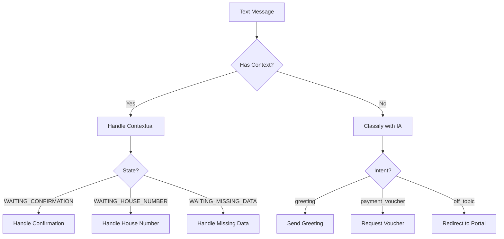
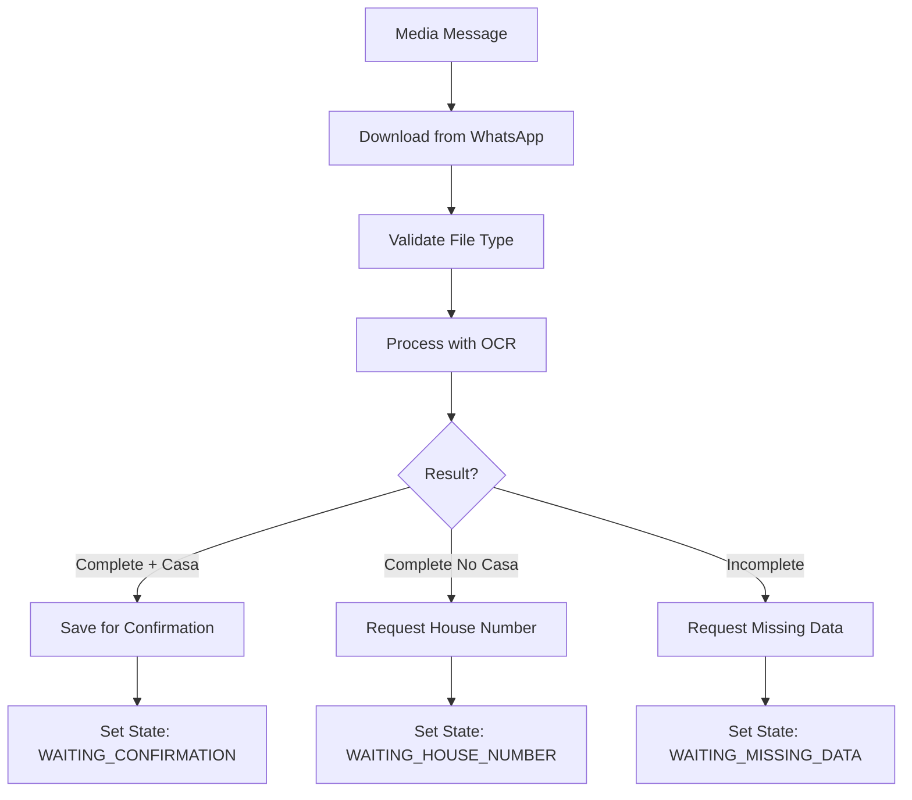

# WhatsApp Integration

## Overview

Integración completa con WhatsApp Business API v23.0 para recepción y procesamiento automatizado de comprobantes de pago.

## Architecture

### Components

```
WhatsApp Integration
├── Webhook Endpoints
│   ├── GET /vouchers/whatsapp-webhook  (Verification)
│   └── POST /vouchers/whatsapp-webhook (Messages)
├── Services
│   ├── WhatsAppMediaService         (Download files)
│   ├── WhatsAppMessageClassifierService (IA classification)
│   └── ConversationStateService     (Context management)
└── Message Handlers
    ├── Text messages
    ├── Image messages
    └── Document messages
```

## Setup

### 1. Meta Developer Account

1. Crear cuenta en [Meta for Developers](https://developers.facebook.com/)
2. Crear nueva App de tipo "Business"
3. Agregar producto "WhatsApp"

### 2. Get Access Token

**Temporary Token (24 hours):**
```
Meta Dashboard > WhatsApp > API Setup > Temporary access token
```

**Permanent Token:**
```
Meta Dashboard > System Users > Add System User > Generate Token
```

### 3. Configure Webhook

**Webhook URL:**
```
https://your-domain.com/vouchers/whatsapp-webhook
```

**Verify Token:**
```env
VERIFY_TOKEN_WA=your_custom_verify_token
```

**Subscription Fields:**
- `messages` ✓

### 4. Environment Variables

```env
# WhatsApp Business API
WHATSAPP_API_TOKEN=EAAXxxxxxxxxxxxxxxxxxxxxx
PHONE_NUMBER_ID_WA=123456789012345
VERIFY_TOKEN_WA=my_secret_verify_token_123
```

## Webhook Endpoints

### GET - Webhook Verification

Meta llama este endpoint para verificar tu webhook.

**Request:**
```http
GET /vouchers/whatsapp-webhook
  ?hub.mode=subscribe
  &hub.verify_token=my_secret_verify_token_123
  &hub.challenge=1234567890
```

**Implementation:**
```typescript
@Get('whatsapp-webhook')
verifyWhatsAppWebhook(@Query() query: any) {
  const mode = query['hub.mode'];
  const token = query['hub.verify_token'];
  const challenge = query['hub.challenge'];

  if (mode === 'subscribe' && token === process.env.VERIFY_TOKEN_WA) {
    return challenge;  // Must return challenge as plain text
  }

  throw new UnauthorizedException('Invalid verification token');
}
```

**Response:**
```
1234567890
```

### POST - Message Processing

Meta envía mensajes entrantes a este endpoint.

**Request Structure:**
```json
{
  "object": "whatsapp_business_account",
  "entry": [{
    "id": "WHATSAPP_BUSINESS_ACCOUNT_ID",
    "changes": [{
      "value": {
        "messaging_product": "whatsapp",
        "metadata": {
          "display_phone_number": "15551234567",
          "phone_number_id": "PHONE_NUMBER_ID"
        },
        "contacts": [{
          "profile": { "name": "John Doe" },
          "wa_id": "521234567890"
        }],
        "messages": [{
          "from": "521234567890",
          "id": "wamid.xxxxx",
          "timestamp": "1696348800",
          "type": "text",
          "text": { "body": "Hola" }
        }]
      },
      "field": "messages"
    }]
  }]
}
```

**Message Types:**

#### Text Message
```json
{
  "type": "text",
  "text": {
    "body": "Hola, quiero registrar un pago"
  }
}
```

#### Image Message
```json
{
  "type": "image",
  "image": {
    "mime_type": "image/jpeg",
    "sha256": "...",
    "id": "1234567890"  // Media ID para descargar
  }
}
```

#### Document Message
```json
{
  "type": "document",
  "document": {
    "filename": "comprobante.pdf",
    "mime_type": "application/pdf",
    "sha256": "...",
    "id": "9876543210"
  }
}
```

## Message Processing Flow

### 1. Text Message Flow



### 2. Image/Document Flow



## Services

### Service Architecture

La integración con WhatsApp está organizada en 3 capas de servicios:

```
┌─────────────────────────────────────────────┐
│    Controllers (VouchersController)         │
│  - Webhook endpoints                        │
│  - Message routing                          │
└────────────┬────────────────────────────────┘
             │
    ┌────────┴─────────┬─────────────────────┐
    │                  │                     │
┌───▼───────────┐ ┌───▼──────────────┐ ┌───▼──────────┐
│ Messaging     │ │ Media            │ │ Classifier   │
│ Service       │ │ Service          │ │ Service      │
│ (Send)        │ │ (Download)       │ │ (AI)         │
└───┬───────────┘ └───┬──────────────┘ └──────────────┘
    │                 │
    └────────┬────────┘
             │
      ┌──────▼──────┐
      │   API       │
      │  Service    │
      │  (HTTP)     │
      └─────────────┘
```

---

### 1. WhatsAppApiService (Base Layer)

**Ubicación**: `src/features/vouchers/services/whatsapp-api.service.ts`

**Responsabilidad**: Servicio genérico para peticiones HTTP a WhatsApp Business API.

**Métodos principales**:

```typescript
// Petición HTTP genérica
async request<T>(
  endpoint: string,
  method: 'GET' | 'POST' | 'DELETE',
  body?: any,
  customHeaders?: Record<string, string>
): Promise<T>

// Enviar mensaje (método conveniente)
async sendMessage(payload: any): Promise<any>

// Obtener información de media
async getMediaInfo(mediaId: string): Promise<any>

// Descargar archivo multimedia
async downloadMedia(mediaUrl: string): Promise<Buffer>

// Verificar configuración
isConfigured(): boolean
getPhoneNumberId(): string
```

**Características**:
- Manejo centralizado de autenticación (TOKEN_WA, PHONE_NUMBER_ID_WA)
- Construcción automática de headers y URLs
- Logging detallado de requests/responses
- Manejo de errores unificado

**Ejemplo de uso**:
```typescript
const response = await whatsappApi.request('/messages', 'POST', {
  messaging_product: 'whatsapp',
  to: '521234567890',
  type: 'text',
  text: { body: 'Hola' }
});
```

---

### 2. WhatsAppMessagingService (Messaging Layer)

**Ubicación**: `src/features/vouchers/services/whatsapp-messaging.service.ts`

**Responsabilidad**: Envío de diferentes tipos de mensajes.

**Métodos principales**:

```typescript
// Mensaje de texto simple
async sendTextMessage(to: string, message: string): Promise<void>

// Mensaje con botones interactivos (máximo 3)
async sendButtonMessage(
  to: string,
  bodyText: string,
  buttons: ButtonOption[]
): Promise<void>

// Mensaje con lista de opciones (máximo 10 por sección)
async sendListMessage(
  to: string,
  bodyText: string,
  buttonText: string,
  sections: ListSection[]
): Promise<void>

// Mensaje con imagen
async sendImageMessage(
  to: string,
  imageUrl: string,
  caption?: string
): Promise<void>

// Mensaje con documento
async sendDocumentMessage(
  to: string,
  documentUrl: string,
  filename: string,
  caption?: string
): Promise<void>
```

**Interfaces**:

```typescript
interface ButtonOption {
  id: string;      // ID único para identificar el botón
  title: string;   // Texto visible (máximo 20 caracteres)
}

interface ListSection {
  title?: string;
  rows: Array<{
    id: string;
    title: string;        // Máximo 24 caracteres
    description?: string; // Máximo 72 caracteres
  }>;
}
```

**Ejemplos de uso**:

```typescript
// Texto simple
await whatsappMessaging.sendTextMessage(
  '521234567890',
  'Tu pago ha sido registrado'
);

// Botones interactivos
await whatsappMessaging.sendButtonMessage(
  '521234567890',
  '¿Son correctos los datos?\n\nMonto: $1,500.15',
  [
    { id: 'confirm', title: '✅ Sí, es correcto' },
    { id: 'cancel', title: '❌ No, cancelar' }
  ]
);

// Lista de opciones
await whatsappMessaging.sendListMessage(
  '521234567890',
  '¿Qué dato deseas corregir?',
  'Seleccionar',
  [{
    rows: [
      { id: 'monto', title: 'Monto', description: 'Corregir el monto' },
      { id: 'fecha', title: 'Fecha', description: 'Corregir la fecha' }
    ]
  }]
);
```

---

### 3. WhatsAppMediaService (Media Layer)

**Ubicación**: `src/features/vouchers/services/whatsapp-media.service.ts`

**Responsabilidad**: Descarga y gestión de archivos multimedia.

**Métodos principales**:

```typescript
// Obtener información de archivo
async getMediaInfo(mediaId: string): Promise<WhatsAppMediaInfo>

// Descargar archivo completo
async downloadMedia(mediaId: string): Promise<{
  buffer: Buffer;
  mimeType: string;
  filename: string;
}>

// Validar tipo de archivo
isSupportedMediaType(mimeType: string): boolean
```

**Interface**:

```typescript
interface WhatsAppMediaInfo {
  url: string;       // URL temporal de descarga
  mimeType: string;  // Tipo MIME
  sha256: string;    // Hash del archivo
  fileSize: number;  // Tamaño en bytes
}
```

**Tipos soportados**:
```typescript
const SUPPORTED_MIME_TYPES = [
  'image/jpeg',
  'image/png',
  'image/gif',
  'image/webp',
  'image/bmp',
  'image/tiff',
  'application/pdf',
];
```

**Ejemplo de uso**:

```typescript
// Descargar archivo
const { buffer, mimeType, filename } = await whatsappMedia.downloadMedia(
  message.image.id
);

// Validar tipo
if (!whatsappMedia.isSupportedMediaType(mimeType)) {
  await whatsappMessaging.sendTextMessage(
    phoneNumber,
    'Tipo de archivo no soportado'
  );
  return;
}

// Procesar buffer
await ocrService.extractTextFromImage(buffer, filename);
```

**Flujo de descarga**:

```typescript
// Paso 1: Obtener URL del archivo
GET https://graph.facebook.com/v23.0/{media_id}
Headers: Authorization: Bearer {token}

Response:
{
  "url": "https://lookaside.fbsbx.com/whatsapp_business/...",
  "mime_type": "image/jpeg",
  "file_size": 123456,
  "sha256": "abc123..."
}

// Paso 2: Descargar archivo
GET {url}
Headers: Authorization: Bearer {token}

Response: Binary data (Buffer)
```

---

### 4. WhatsAppMessageClassifierService

**Ubicación**: `src/features/vouchers/services/whatsapp-message-classifier.service.ts`

**Responsabilidad**: Clasificación de mensajes usando IA (OpenAI/Vertex AI).

**Intents:**
```typescript
enum MessageIntent {
  PAYMENT_VOUCHER = 'payment_voucher',  // User wants to send voucher
  GREETING = 'greeting',                // Hello, hi, etc.
  OFF_TOPIC = 'off_topic',             // Unrelated to payments
}
```

**Examples:**

```typescript
// Input: "Hola buenos días"
// Output: { intent: 'greeting', confidence: 0.95 }

// Input: "Quiero registrar mi pago"
// Output: { intent: 'payment_voucher', confidence: 0.98 }

// Input: "¿Cuál es el clima hoy?"
// Output: { intent: 'off_topic', confidence: 0.92 }
```

**Prompt Template:**
```
Eres un asistente automático de WhatsApp para un sistema de registro de pagos.

Tu ÚNICA función es procesar comprobantes de pago.

Clasifica el siguiente mensaje en UNA de estas categorías:
- payment_voucher: Usuario quiere enviar/registrar un comprobante de pago
- greeting: Saludos generales
- off_topic: Cualquier otro tema

NO puedes proporcionar información sobre:
- Estados de cuenta
- Saldos
- Historial de pagos
- Otra información que requiera acceso a la base de datos

Mensaje: "{messageText}"

Responde SOLO con JSON válido:
{
  "intent": "payment_voucher|greeting|off_topic",
  "confidence": 0.0-1.0
}
```

### ConversationStateService

Manages conversation context and state.

**States:**
```typescript
enum ConversationState {
  IDLE = 'idle',
  WAITING_CONFIRMATION = 'waiting_confirmation',
  WAITING_HOUSE_NUMBER = 'waiting_house_number',
  WAITING_MISSING_DATA = 'waiting_missing_data',
}
```

**Methods:**

```typescript
// Save context
saveVoucherForConfirmation(
  phoneNumber: string,
  voucherData: StructuredDataWithCasa,
  gcsFilename?: string,
  originalFilename?: string,
  confirmationCode?: string
)

// Get context
getContext(phoneNumber: string): ConversationContext | null

// Check state
isWaitingConfirmation(phoneNumber: string): boolean

// Clear context
clearContext(phoneNumber: string): void
```

**Session Management:**
- **Timeout**: 10 minutes
- **Auto-cleanup**: Every 5 minutes
- **Storage**: In-memory Map

## Sending Messages

### Send Text Message

```typescript
private async sendWhatsAppMessage(
  to: string,
  message: string,
): Promise<void> {
  const url = `https://graph.facebook.com/v23.0/${process.env.PHONE_NUMBER_ID_WA}/messages`;

  const response = await axios.post(
    url,
    {
      messaging_product: 'whatsapp',
      to: to,
      type: 'text',
      text: { body: message },
    },
    {
      headers: {
        'Content-Type': 'application/json',
        'Authorization': `Bearer ${process.env.WHATSAPP_API_TOKEN}`,
      },
    }
  );
}
```

**Request:**
```json
{
  "messaging_product": "whatsapp",
  "to": "521234567890",
  "type": "text",
  "text": {
    "body": "¡Hola! Gracias por contactarnos."
  }
}
```

**Response:**
```json
{
  "messaging_product": "whatsapp",
  "contacts": [{
    "input": "521234567890",
    "wa_id": "521234567890"
  }],
  "messages": [{
    "id": "wamid.HBgNNTIxNTU1MTIzNDU2NxUCABEYEjQwRTc5NDFCREY1N0M5Qzg1MgA="
  }]
}
```

## Message Templates (Centralized)

Todos los mensajes están centralizados en `src/shared/content/messages/whatsapp/`

**Greeting:**
```typescript
import { GreetingMessages } from '@/shared/content';

await sendWhatsAppMessage(phoneNumber, GreetingMessages.default);
// → "¡Hola! Soy tu asistente automatizado..."
```

**Confirmation:**
```typescript
import { ConfirmationMessages } from '@/shared/content';

await sendWhatsAppMessage(
  phoneNumber,
  ConfirmationMessages.success({
    casa: 15,
    monto: "$1,500.15",
    fecha_pago: "2024-10-03",
    referencia: "REF123",
    hora_transaccion: "14:30:45",
    confirmation_code: "202410-A7K2M3P"
  })
);
```

**Error:**
```typescript
import { ErrorMessages } from '@/shared/content';

await sendWhatsAppMessage(
  phoneNumber,
  ErrorMessages.unsupportedFileType('image/svg+xml')
);
```

Ver: [Content Dictionary](../../modules/content/README.md)

## Error Handling

### Common Errors

#### 1. Invalid Token
```json
{
  "error": {
    "message": "(#190) This message is sent outside of allowed window.",
    "type": "OAuthException",
    "code": 190
  }
}
```

**Solution:**
- Verificar token no expirado
- Generar nuevo token desde Meta Dashboard
- Para producción: usar System User token

#### 2. Recipient Not Allowed
```json
{
  "error": {
    "message": "(#131030) Recipient phone number not in allowed list",
    "type": "OAuthException",
    "code": 131030
  }
}
```

**Solution:**
- **Development**: Agregar número a "Phone numbers" en Meta Dashboard
- **Production**: Mover app a Live mode con Business Verification completa

#### 3. Message Outside Window
```json
{
  "error": {
    "message": "(#131047) Message failed to send because more than 24 hours have passed",
    "code": 131047
  }
}
```

**Solution:**
- Solo puedes responder dentro de 24 horas del último mensaje del usuario
- Después de 24h necesitas usar Message Templates aprobados

#### 4. Rate Limiting
```json
{
  "error": {
    "message": "(#4) Application request limit reached",
    "code": 4
  }
}
```

**Solution:**
- Implementar rate limiting en tu backend
- Usar queues (Bull/Redis) para controlar flujo
- Actualizar tier de tu WhatsApp Business Account

---

## Complete Example: Processing Voucher with Interactive Messages

Ejemplo completo del flujo de procesamiento de un voucher usando los servicios refactorizados:

```typescript
import { Controller, Post, Body } from '@nestjs/common';
import { WhatsAppMessagingService } from '../services/whatsapp-messaging.service';
import { WhatsAppMediaService } from '../services/whatsapp-media.service';
import { OcrService } from '../services/ocr.service';
import { VoucherRepository } from '@/shared/database/repositories/voucher.repository';

@Controller('vouchers')
export class VouchersController {
  constructor(
    private readonly whatsappMessaging: WhatsAppMessagingService,
    private readonly whatsappMedia: WhatsAppMediaService,
    private readonly ocrService: OcrService,
    private readonly voucherRepository: VoucherRepository,
  ) {}

  @Post('webhook/whatsapp')
  async receiveWhatsAppMessage(@Body() body: any) {
    const message = body.entry?.[0]?.changes?.[0]?.value?.messages?.[0];
    if (!message) return { success: true };

    const phoneNumber = message.from;
    const messageType = message.type;

    // CASO 1: Usuario envía imagen con comprobante
    if (messageType === 'image') {
      try {
        // 1. Descargar imagen
        const { buffer, mimeType, filename } =
          await this.whatsappMedia.downloadMedia(message.image.id);

        // 2. Validar tipo de archivo
        if (!this.whatsappMedia.isSupportedMediaType(mimeType)) {
          await this.whatsappMessaging.sendTextMessage(
            phoneNumber,
            'Solo se permiten imágenes JPG, PNG, PDF'
          );
          return { success: true };
        }

        // 3. Procesar con OCR
        const ocrResult = await this.ocrService.extractTextFromImage(
          buffer,
          filename
        );

        // 4. Enviar confirmación con botones interactivos
        await this.whatsappMessaging.sendButtonMessage(
          phoneNumber,
          `¿Son correctos estos datos?\n\n` +
          `Monto: ${ocrResult.monto}\n` +
          `Fecha: ${ocrResult.fecha_pago}\n` +
          `Casa: ${ocrResult.casa}\n` +
          `Referencia: ${ocrResult.referencia}`,
          [
            { id: 'confirm', title: '✅ Sí, es correcto' },
            { id: 'cancel', title: '❌ No, cancelar' }
          ]
        );

        // 5. Guardar contexto para la siguiente respuesta
        this.saveContext(phoneNumber, ocrResult);

      } catch (error) {
        await this.whatsappMessaging.sendTextMessage(
          phoneNumber,
          'Error al procesar el comprobante. Intenta nuevamente.'
        );
      }

      return { success: true };
    }

    // CASO 2: Usuario presiona botón de confirmación
    if (messageType === 'interactive') {
      const buttonId = message.interactive.button_reply?.id;
      const listId = message.interactive.list_reply?.id;
      const response = buttonId || listId;

      if (response === 'confirm') {
        // 1. Recuperar datos guardados
        const savedData = this.getContext(phoneNumber);

        // 2. Insertar en base de datos
        const voucher = await this.voucherRepository.create({
          date: savedData.fecha_pago,
          authorization_number: savedData.referencia,
          amount: parseFloat(savedData.monto),
          confirmation_code: this.generateConfirmationCode(),
          confirmation_status: false,
          url: savedData.gcsFilename,
        });

        // 3. Enviar confirmación final
        await this.whatsappMessaging.sendTextMessage(
          phoneNumber,
          `✅ ¡Pago registrado exitosamente!\n\n` +
          `🔐 Código de confirmación: ${voucher.confirmation_code}\n\n` +
          `Guarda este código para futuras consultas.`
        );

        // 4. Limpiar contexto
        this.clearContext(phoneNumber);

      } else if (response === 'cancel') {
        // Ofrecer opciones de corrección
        await this.whatsappMessaging.sendListMessage(
          phoneNumber,
          '¿Qué dato deseas corregir?',
          'Seleccionar dato',
          [{
            rows: [
              {
                id: 'monto',
                title: 'Monto',
                description: 'Corregir el monto del pago'
              },
              {
                id: 'fecha',
                title: 'Fecha',
                description: 'Corregir la fecha de pago'
              },
              {
                id: 'casa',
                title: 'Número de casa',
                description: 'Corregir número de casa'
              },
              {
                id: 'cancelar_todo',
                title: 'Cancelar registro',
                description: 'No registrar este pago'
              }
            ]
          }]
        );

      } else if (['monto', 'fecha', 'casa'].includes(response)) {
        // Usuario seleccionó un dato a corregir
        this.setContext(phoneNumber, { fieldToCorrect: response });

        await this.whatsappMessaging.sendTextMessage(
          phoneNumber,
          `Por favor, envía el nuevo valor para: ${this.getFieldLabel(response)}`
        );

      } else if (response === 'cancelar_todo') {
        // Eliminar archivo y limpiar
        const savedData = this.getContext(phoneNumber);
        if (savedData?.gcsFilename) {
          await this.cloudStorageService.deleteFile(savedData.gcsFilename);
        }

        await this.whatsappMessaging.sendTextMessage(
          phoneNumber,
          'Entendido, he cancelado el registro.'
        );

        this.clearContext(phoneNumber);
      }

      return { success: true };
    }

    // CASO 3: Usuario envía texto (corrección de datos)
    if (messageType === 'text') {
      const context = this.getContext(phoneNumber);

      if (context?.fieldToCorrect) {
        // Actualizar el dato corregido
        const fieldToCorrect = context.fieldToCorrect;
        const newValue = message.text.body;

        context.voucherData[fieldToCorrect] = newValue;
        this.updateContext(phoneNumber, context);

        // Volver a pedir confirmación con datos actualizados
        await this.whatsappMessaging.sendButtonMessage(
          phoneNumber,
          `✅ Dato actualizado.\n\n` +
          `¿Son correctos estos datos?\n\n` +
          `Monto: ${context.voucherData.monto}\n` +
          `Fecha: ${context.voucherData.fecha_pago}\n` +
          `Casa: ${context.voucherData.casa}\n` +
          `Referencia: ${context.voucherData.referencia}`,
          [
            { id: 'confirm', title: '✅ Sí, es correcto' },
            { id: 'cancel', title: '❌ No, cancelar' }
          ]
        );

        return { success: true };
      }

      // Si no hay contexto, clasificar mensaje con IA
      const classification = await this.messageClassifier.classifyMessage(
        message.text.body
      );

      await this.whatsappMessaging.sendTextMessage(
        phoneNumber,
        classification.response
      );
    }

    return { success: true };
  }

  private generateConfirmationCode(): string {
    const now = new Date();
    const year = now.getFullYear();
    const month = String(now.getMonth() + 1).padStart(2, '0');
    const random = Math.random().toString(36).substring(2, 9).toUpperCase();
    return `${year}${month}-${random}`;
  }

  private getFieldLabel(field: string): string {
    const labels = {
      monto: 'Monto del pago',
      fecha: 'Fecha de pago',
      casa: 'Número de casa',
      referencia: 'Referencia bancaria'
    };
    return labels[field] || field;
  }

  // Métodos de contexto (simplificados para el ejemplo)
  private contextStore = new Map<string, any>();

  private saveContext(phoneNumber: string, data: any) {
    this.contextStore.set(phoneNumber, data);
  }

  private getContext(phoneNumber: string) {
    return this.contextStore.get(phoneNumber);
  }

  private setContext(phoneNumber: string, data: any) {
    const existing = this.getContext(phoneNumber) || {};
    this.contextStore.set(phoneNumber, { ...existing, ...data });
  }

  private updateContext(phoneNumber: string, data: any) {
    this.contextStore.set(phoneNumber, data);
  }

  private clearContext(phoneNumber: string) {
    this.contextStore.delete(phoneNumber);
  }
}
```

**Flujo completo visualizado**:

```
1. Usuario envía imagen
   ↓
2. whatsappMedia.downloadMedia()
   ↓
3. ocrService.extractTextFromImage()
   ↓
4. whatsappMessaging.sendButtonMessage() → Botones: SI/NO
   ↓
5a. Usuario presiona "SI"
    ↓
    voucherRepository.create()
    ↓
    whatsappMessaging.sendTextMessage() → Confirmación con código
    ↓
    FIN

5b. Usuario presiona "NO"
    ↓
    whatsappMessaging.sendListMessage() → Lista de datos a corregir
    ↓
    Usuario selecciona dato (ej: "monto")
    ↓
    whatsappMessaging.sendTextMessage() → "Envía el nuevo valor"
    ↓
    Usuario envía nuevo valor
    ↓
    Actualizar contexto
    ↓
    whatsappMessaging.sendButtonMessage() → Botones: SI/NO (volver a 5a)
```

---

## Testing

### Using WhatsApp Sandbox

**Test Numbers (Development):**
```
1. Go to Meta Dashboard > WhatsApp > API Setup
2. Send WhatsApp message to test number
3. Follow instructions to link your phone
```

### Webhook Testing

**Use ngrok for local development:**
```bash
ngrok http 3000

# Use ngrok URL in Meta Dashboard
https://abc123.ngrok.io/vouchers/whatsapp-webhook
```

**Test with cURL:**
```bash
# Verification
curl "http://localhost:3000/vouchers/whatsapp-webhook?hub.mode=subscribe&hub.verify_token=my_secret_verify_token_123&hub.challenge=test123"

# Message
curl -X POST http://localhost:3000/vouchers/whatsapp-webhook \
  -H "Content-Type: application/json" \
  -d '{
    "object": "whatsapp_business_account",
    "entry": [{
      "changes": [{
        "value": {
          "messages": [{
            "from": "521234567890",
            "type": "text",
            "text": { "body": "Hola" }
          }]
        }
      }]
    }]
  }'
```

## Performance

### Response Time Requirements

WhatsApp requiere respuesta < 20 segundos:

```typescript
@Post('whatsapp-webhook')
async receiveWhatsAppMessage(@Body() body: any) {
  // MUST respond quickly
  const immediate = { success: true };

  // Process asynchronously (don't await)
  this.processMessageAsync(body);

  return immediate;  // < 1 second
}

private async processMessageAsync(body: any) {
  // Long-running OCR, IA, etc.
  // Can take 2-5 seconds
}
```

### Optimization Tips

1. **Respond immediately**: Return 200 OK before processing
2. **Process async**: OCR/IA en background
3. **Cache tokens**: Reusar WhatsApp API token
4. **Batch downloads**: Si múltiples archivos
5. **Queue system**: Bull/Redis for high volume

## Security

### Webhook Security

**Verify Signature (Recommended):**
```typescript
import crypto from 'crypto';

function verifyWebhookSignature(payload: string, signature: string): boolean {
  const expectedSignature = crypto
    .createHmac('sha256', process.env.APP_SECRET)
    .update(payload)
    .digest('hex');

  return signature === `sha256=${expectedSignature}`;
}
```

**Validate Origin:**
```typescript
// Only accept from WhatsApp IPs
const WHATSAPP_IPS = [
  '157.240.0.0/16',
  '31.13.24.0/21',
  // ... more IPs from Meta documentation
];
```

### Token Security

```env
# NEVER commit to git
# Use environment variables
WHATSAPP_API_TOKEN=EAAXxxxxxxxxx

# Rotate tokens regularly
# Use System User tokens for production
```

## Related Documentation

- [Vouchers Feature](README.md) - Overview del módulo
- [Conversation Flow](conversation-flow.md) - Diagramas de flujo
- [Content Dictionary](../../modules/content/README.md) - Mensajes
- [WhatsApp Business API Docs](https://developers.facebook.com/docs/whatsapp)
- [Meta Graph API](https://developers.facebook.com/docs/graph-api)
