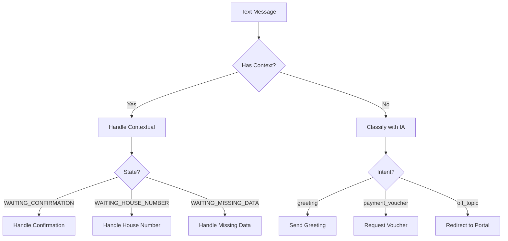
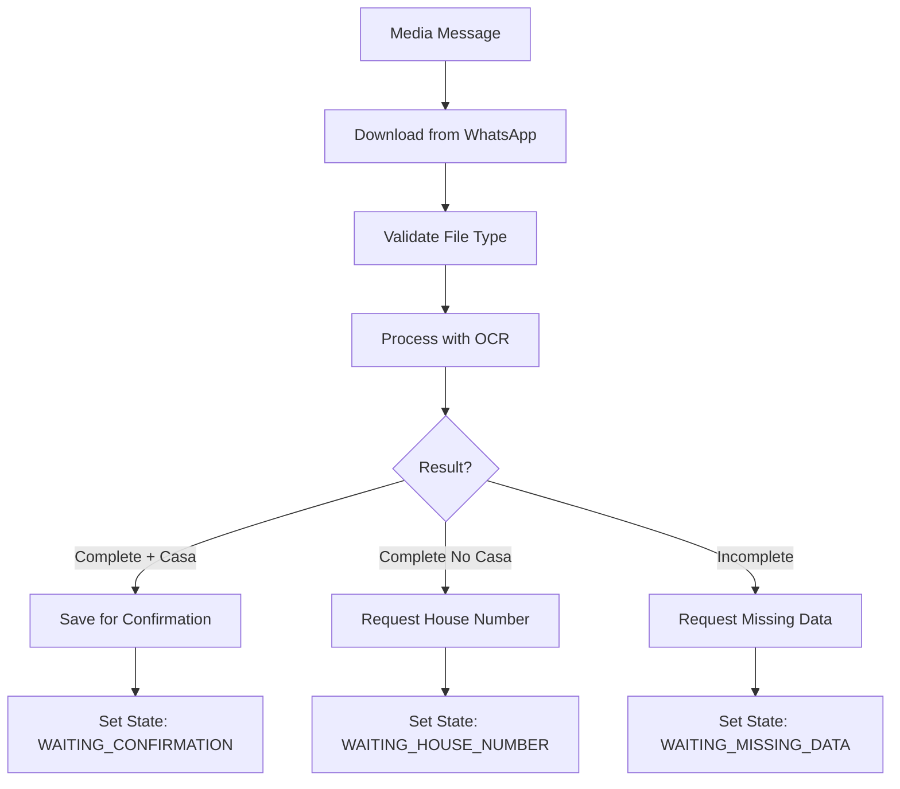

# WhatsApp Integration

## Overview

Integración completa con WhatsApp Business API v23.0 para recepción y procesamiento automatizado de comprobantes de pago.

## Architecture

### Components

```
WhatsApp Integration
├── Webhook Endpoints
│   ├── GET /vouchers/whatsapp-webhook  (Verification)
│   └── POST /vouchers/whatsapp-webhook (Messages)
├── Services
│   ├── WhatsAppMediaService         (Download files)
│   ├── WhatsAppMessageClassifierService (IA classification)
│   └── ConversationStateService     (Context management)
└── Message Handlers
    ├── Text messages
    ├── Image messages
    └── Document messages
```

## Setup

### 1. Meta Developer Account

1. Crear cuenta en [Meta for Developers](https://developers.facebook.com/)
2. Crear nueva App de tipo "Business"
3. Agregar producto "WhatsApp"

### 2. Get Access Token

**Temporary Token (24 hours):**
```
Meta Dashboard > WhatsApp > API Setup > Temporary access token
```

**Permanent Token:**
```
Meta Dashboard > System Users > Add System User > Generate Token
```

### 3. Configure Webhook

**Webhook URL:**
```
https://your-domain.com/vouchers/whatsapp-webhook
```

**Verify Token:**
```env
VERIFY_TOKEN_WA=your_custom_verify_token
```

**Subscription Fields:**
- `messages` ✓

### 4. Environment Variables

```env
# WhatsApp Business API
WHATSAPP_API_TOKEN=EAAXxxxxxxxxxxxxxxxxxxxxx
PHONE_NUMBER_ID_WA=123456789012345
VERIFY_TOKEN_WA=my_secret_verify_token_123
```

## Webhook Endpoints

### GET - Webhook Verification

Meta llama este endpoint para verificar tu webhook.

**Request:**
```http
GET /vouchers/whatsapp-webhook
  ?hub.mode=subscribe
  &hub.verify_token=my_secret_verify_token_123
  &hub.challenge=1234567890
```

**Implementation:**
```typescript
@Get('whatsapp-webhook')
verifyWhatsAppWebhook(@Query() query: any) {
  const mode = query['hub.mode'];
  const token = query['hub.verify_token'];
  const challenge = query['hub.challenge'];

  if (mode === 'subscribe' && token === process.env.VERIFY_TOKEN_WA) {
    return challenge;  // Must return challenge as plain text
  }

  throw new UnauthorizedException('Invalid verification token');
}
```

**Response:**
```
1234567890
```

### POST - Message Processing

Meta envía mensajes entrantes a este endpoint.

**Request Structure:**
```json
{
  "object": "whatsapp_business_account",
  "entry": [{
    "id": "WHATSAPP_BUSINESS_ACCOUNT_ID",
    "changes": [{
      "value": {
        "messaging_product": "whatsapp",
        "metadata": {
          "display_phone_number": "15551234567",
          "phone_number_id": "PHONE_NUMBER_ID"
        },
        "contacts": [{
          "profile": { "name": "John Doe" },
          "wa_id": "521234567890"
        }],
        "messages": [{
          "from": "521234567890",
          "id": "wamid.xxxxx",
          "timestamp": "1696348800",
          "type": "text",
          "text": { "body": "Hola" }
        }]
      },
      "field": "messages"
    }]
  }]
}
```

**Message Types:**

#### Text Message
```json
{
  "type": "text",
  "text": {
    "body": "Hola, quiero registrar un pago"
  }
}
```

#### Image Message
```json
{
  "type": "image",
  "image": {
    "mime_type": "image/jpeg",
    "sha256": "...",
    "id": "1234567890"  // Media ID para descargar
  }
}
```

#### Document Message
```json
{
  "type": "document",
  "document": {
    "filename": "comprobante.pdf",
    "mime_type": "application/pdf",
    "sha256": "...",
    "id": "9876543210"
  }
}
```

## Message Processing Flow

### 1. Text Message Flow



### 2. Image/Document Flow



## Services

### WhatsAppMediaService

Downloads files from WhatsApp using media ID.

**Methods:**

#### downloadMedia(mediaId)
```typescript
async downloadMedia(mediaId: string): Promise<{
  buffer: Buffer;
  mimeType: string;
  filename: string;
}>
```

**Implementation:**
```typescript
// Step 1: Get media URL
GET https://graph.facebook.com/v23.0/{media_id}
Headers: Authorization: Bearer {token}

Response:
{
  "url": "https://lookaside.fbsbx.com/whatsapp_business/...",
  "mime_type": "image/jpeg",
  "file_size": 123456
}

// Step 2: Download file
GET {url}
Headers: Authorization: Bearer {token}

Response: Binary file data
```

#### isSupportedMediaType(mimeType)
```typescript
const SUPPORTED_MIME_TYPES = [
  'image/jpeg',
  'image/png',
  'image/webp',
  'application/pdf',
];
```

### WhatsAppMessageClassifierService

Classifies user messages using AI.

**Intents:**
```typescript
enum MessageIntent {
  PAYMENT_VOUCHER = 'payment_voucher',  // User wants to send voucher
  GREETING = 'greeting',                // Hello, hi, etc.
  OFF_TOPIC = 'off_topic',             // Unrelated to payments
}
```

**Examples:**

```typescript
// Input: "Hola buenos días"
// Output: { intent: 'greeting', confidence: 0.95 }

// Input: "Quiero registrar mi pago"
// Output: { intent: 'payment_voucher', confidence: 0.98 }

// Input: "¿Cuál es el clima hoy?"
// Output: { intent: 'off_topic', confidence: 0.92 }
```

**Prompt Template:**
```
Eres un asistente automático de WhatsApp para un sistema de registro de pagos.

Tu ÚNICA función es procesar comprobantes de pago.

Clasifica el siguiente mensaje en UNA de estas categorías:
- payment_voucher: Usuario quiere enviar/registrar un comprobante de pago
- greeting: Saludos generales
- off_topic: Cualquier otro tema

NO puedes proporcionar información sobre:
- Estados de cuenta
- Saldos
- Historial de pagos
- Otra información que requiera acceso a la base de datos

Mensaje: "{messageText}"

Responde SOLO con JSON válido:
{
  "intent": "payment_voucher|greeting|off_topic",
  "confidence": 0.0-1.0
}
```

### ConversationStateService

Manages conversation context and state.

**States:**
```typescript
enum ConversationState {
  IDLE = 'idle',
  WAITING_CONFIRMATION = 'waiting_confirmation',
  WAITING_HOUSE_NUMBER = 'waiting_house_number',
  WAITING_MISSING_DATA = 'waiting_missing_data',
}
```

**Methods:**

```typescript
// Save context
saveVoucherForConfirmation(
  phoneNumber: string,
  voucherData: StructuredDataWithCasa,
  gcsFilename?: string,
  originalFilename?: string,
  confirmationCode?: string
)

// Get context
getContext(phoneNumber: string): ConversationContext | null

// Check state
isWaitingConfirmation(phoneNumber: string): boolean

// Clear context
clearContext(phoneNumber: string): void
```

**Session Management:**
- **Timeout**: 10 minutes
- **Auto-cleanup**: Every 5 minutes
- **Storage**: In-memory Map

## Sending Messages

### Send Text Message

```typescript
private async sendWhatsAppMessage(
  to: string,
  message: string,
): Promise<void> {
  const url = `https://graph.facebook.com/v23.0/${process.env.PHONE_NUMBER_ID_WA}/messages`;

  const response = await axios.post(
    url,
    {
      messaging_product: 'whatsapp',
      to: to,
      type: 'text',
      text: { body: message },
    },
    {
      headers: {
        'Content-Type': 'application/json',
        'Authorization': `Bearer ${process.env.WHATSAPP_API_TOKEN}`,
      },
    }
  );
}
```

**Request:**
```json
{
  "messaging_product": "whatsapp",
  "to": "521234567890",
  "type": "text",
  "text": {
    "body": "¡Hola! Gracias por contactarnos."
  }
}
```

**Response:**
```json
{
  "messaging_product": "whatsapp",
  "contacts": [{
    "input": "521234567890",
    "wa_id": "521234567890"
  }],
  "messages": [{
    "id": "wamid.HBgNNTIxNTU1MTIzNDU2NxUCABEYEjQwRTc5NDFCREY1N0M5Qzg1MgA="
  }]
}
```

## Message Templates (Centralized)

Todos los mensajes están centralizados en `src/shared/content/messages/whatsapp/`

**Greeting:**
```typescript
import { GreetingMessages } from '@/shared/content';

await sendWhatsAppMessage(phoneNumber, GreetingMessages.default);
// → "¡Hola! Soy tu asistente automatizado..."
```

**Confirmation:**
```typescript
import { ConfirmationMessages } from '@/shared/content';

await sendWhatsAppMessage(
  phoneNumber,
  ConfirmationMessages.success({
    casa: 15,
    monto: "$1,500.15",
    fecha_pago: "2024-10-03",
    referencia: "REF123",
    hora_transaccion: "14:30:45",
    confirmation_code: "202410-A7K2M3P"
  })
);
```

**Error:**
```typescript
import { ErrorMessages } from '@/shared/content';

await sendWhatsAppMessage(
  phoneNumber,
  ErrorMessages.unsupportedFileType('image/svg+xml')
);
```

Ver: [Content Dictionary](../../modules/content/README.md)

## Error Handling

### Common Errors

#### 1. Invalid Token
```json
{
  "error": {
    "message": "(#190) This message is sent outside of allowed window.",
    "type": "OAuthException",
    "code": 190
  }
}
```

**Solution:**
- Verificar token no expirado
- Generar nuevo token desde Meta Dashboard
- Para producción: usar System User token

#### 2. Recipient Not Allowed
```json
{
  "error": {
    "message": "(#131030) Recipient phone number not in allowed list",
    "type": "OAuthException",
    "code": 131030
  }
}
```

**Solution:**
- **Development**: Agregar número a "Phone numbers" en Meta Dashboard
- **Production**: Mover app a Live mode con Business Verification completa

#### 3. Message Outside Window
```json
{
  "error": {
    "message": "(#131047) Message failed to send because more than 24 hours have passed",
    "code": 131047
  }
}
```

**Solution:**
- Solo puedes responder dentro de 24 horas del último mensaje del usuario
- Después de 24h necesitas usar Message Templates aprobados

#### 4. Rate Limiting
```json
{
  "error": {
    "message": "(#4) Application request limit reached",
    "code": 4
  }
}
```

**Solution:**
- Implementar rate limiting en tu backend
- Usar queues (Bull/Redis) para controlar flujo
- Actualizar tier de tu WhatsApp Business Account

## Testing

### Using WhatsApp Sandbox

**Test Numbers (Development):**
```
1. Go to Meta Dashboard > WhatsApp > API Setup
2. Send WhatsApp message to test number
3. Follow instructions to link your phone
```

### Webhook Testing

**Use ngrok for local development:**
```bash
ngrok http 3000

# Use ngrok URL in Meta Dashboard
https://abc123.ngrok.io/vouchers/whatsapp-webhook
```

**Test with cURL:**
```bash
# Verification
curl "http://localhost:3000/vouchers/whatsapp-webhook?hub.mode=subscribe&hub.verify_token=my_secret_verify_token_123&hub.challenge=test123"

# Message
curl -X POST http://localhost:3000/vouchers/whatsapp-webhook \
  -H "Content-Type: application/json" \
  -d '{
    "object": "whatsapp_business_account",
    "entry": [{
      "changes": [{
        "value": {
          "messages": [{
            "from": "521234567890",
            "type": "text",
            "text": { "body": "Hola" }
          }]
        }
      }]
    }]
  }'
```

## Performance

### Response Time Requirements

WhatsApp requiere respuesta < 20 segundos:

```typescript
@Post('whatsapp-webhook')
async receiveWhatsAppMessage(@Body() body: any) {
  // MUST respond quickly
  const immediate = { success: true };

  // Process asynchronously (don't await)
  this.processMessageAsync(body);

  return immediate;  // < 1 second
}

private async processMessageAsync(body: any) {
  // Long-running OCR, IA, etc.
  // Can take 2-5 seconds
}
```

### Optimization Tips

1. **Respond immediately**: Return 200 OK before processing
2. **Process async**: OCR/IA en background
3. **Cache tokens**: Reusar WhatsApp API token
4. **Batch downloads**: Si múltiples archivos
5. **Queue system**: Bull/Redis for high volume

## Security

### Webhook Security

**Verify Signature (Recommended):**
```typescript
import crypto from 'crypto';

function verifyWebhookSignature(payload: string, signature: string): boolean {
  const expectedSignature = crypto
    .createHmac('sha256', process.env.APP_SECRET)
    .update(payload)
    .digest('hex');

  return signature === `sha256=${expectedSignature}`;
}
```

**Validate Origin:**
```typescript
// Only accept from WhatsApp IPs
const WHATSAPP_IPS = [
  '157.240.0.0/16',
  '31.13.24.0/21',
  // ... more IPs from Meta documentation
];
```

### Token Security

```env
# NEVER commit to git
# Use environment variables
WHATSAPP_API_TOKEN=EAAXxxxxxxxxx

# Rotate tokens regularly
# Use System User tokens for production
```

## Related Documentation

- [Vouchers Feature](README.md) - Overview del módulo
- [Conversation Flow](conversation-flow.md) - Diagramas de flujo
- [Content Dictionary](../../modules/content/README.md) - Mensajes
- [WhatsApp Business API Docs](https://developers.facebook.com/docs/whatsapp)
- [Meta Graph API](https://developers.facebook.com/docs/graph-api)
