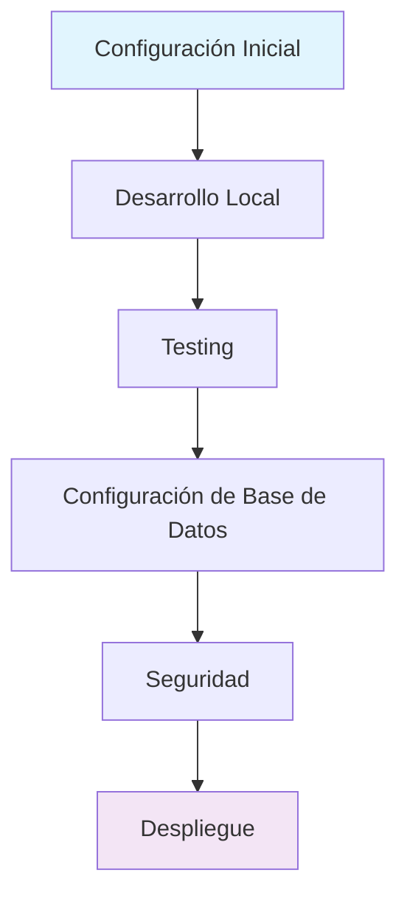

# 📖 Guías - El Agave Backend

## 📋 Descripción General

Esta sección contiene guías paso a paso para configurar, desarrollar y desplegar el sistema El Agave Backend. Las guías están organizadas por nivel de experiencia y propósito.

## 🚀 Guías Disponibles

### 🛠️ [Configuración Inicial](./setup.md)
**Nivel**: Principiante  
**Tiempo estimado**: 30 minutos

Guía completa para configurar el entorno de desarrollo desde cero:
- Instalación de dependencias
- Configuración de variables de entorno
- Configuración de Supabase
- Verificación de la instalación

### 💻 [Desarrollo Local](./development.md)
**Nivel**: Intermedio  
**Tiempo estimado**: 45 minutos

Guía para desarrolladores que trabajan en el proyecto:
- Estructura del proyecto
- Comandos de desarrollo
- Debugging y testing
- Convenciones de código
- Flujo de trabajo Git

### 🚀 [Despliegue](./deployment.md)
**Nivel**: Avanzado  
**Tiempo estimado**: 60 minutos

Guía para desplegar el sistema en producción:
- Preparación del entorno
- Configuración de servidor
- Despliegue con Docker
- Configuración de CI/CD
- Monitoreo y logs

### 🔧 [Configuración de Base de Datos](./database.md)
**Nivel**: Intermedio  
**Tiempo estimado**: 40 minutos

Guía para configurar y gestionar la base de datos:
- Configuración de Supabase
- Migraciones y esquemas
- Backup y restauración
- Optimización de consultas

### 🧪 [Testing](./testing.md)
**Nivel**: Intermedio  
**Tiempo estimado**: 35 minutos

Guía para escribir y ejecutar pruebas:
- Configuración de Jest
- Pruebas unitarias
- Pruebas de integración
- Pruebas end-to-end
- Cobertura de código

### 🔒 [Seguridad](./security.md)
**Nivel**: Avanzado  
**Tiempo estimado**: 50 minutos

Guía de mejores prácticas de seguridad:
- Configuración de autenticación
- Validación de datos
- Rate limiting
- Logs de auditoría
- Penetration testing

## 📊 Estadísticas de Guías

| Categoría | Cantidad | Estado |
|-----------|----------|--------|
| Configuración | 2 | ✅ Completadas |
| Desarrollo | 2 | ✅ Completadas |
| Despliegue | 1 | ✅ Completada |
| Testing | 1 | ✅ Completada |
| Seguridad | 1 | ✅ Completada |

**Total de guías**: 7

## 🎯 Audiencia Objetivo

### 👶 Principiante
- Desarrolladores nuevos en el proyecto
- Configuración inicial del entorno
- Conceptos básicos de NestJS

### 👨‍💻 Intermedio
- Desarrolladores con experiencia
- Mejores prácticas de desarrollo
- Testing y debugging

### 🧙‍♂️ Avanzado
- DevOps y administradores de sistemas
- Configuración de producción
- Optimización y monitoreo

## 🔄 Flujo de Aprendizaje Recomendado

## 📝 Convenciones de las Guías

### Estructura Estándar
1. **Descripción**: Objetivo y alcance
2. **Prerrequisitos**: Requisitos previos
3. **Pasos**: Instrucciones paso a paso
4. **Verificación**: Cómo verificar el éxito
5. **Solución de Problemas**: Errores comunes
6. **Referencias**: Enlaces adicionales

### Elementos Visuales
- 📋 Listas de verificación
- ⚠️ Advertencias importantes
- 💡 Tips y trucos
- 🔗 Enlaces a recursos
- 📝 Notas adicionales

### Código
- Bloques de código con sintaxis highlighting
- Comandos de terminal claramente marcados
- Ejemplos prácticos y realistas
- Explicaciones de cada comando

## 🆘 Soporte

### Recursos Adicionales
- [Documentación de NestJS](https://docs.nestjs.com/)
- [Documentación de Supabase](https://supabase.com/docs)
- [Comunidad de Discord](https://discord.gg/nestjs)

### Contacto
- **Email**: backend@elagave.com
- **Slack**: #backend-support
- **GitHub Issues**: Para reportar problemas

## 🚀 Próximas Guías

### Planificadas
- [ ] **Microservicios**: Arquitectura de microservicios
- [ ] **Performance**: Optimización de rendimiento
- [ ] **Monitoring**: Configuración de monitoreo
- [ ] **Backup**: Estrategias de backup y recuperación
- [ ] **Scaling**: Escalabilidad horizontal y vertical

### En Desarrollo
- [ ] **API Design**: Diseño de APIs RESTful
- [ ] **Error Handling**: Manejo de errores avanzado
- [ ] **Logging**: Configuración de logs estructurados

---

**Última actualización**: $(date)  
**Versión**: 1.0.0  
**Responsable**: Equipo de Documentación
