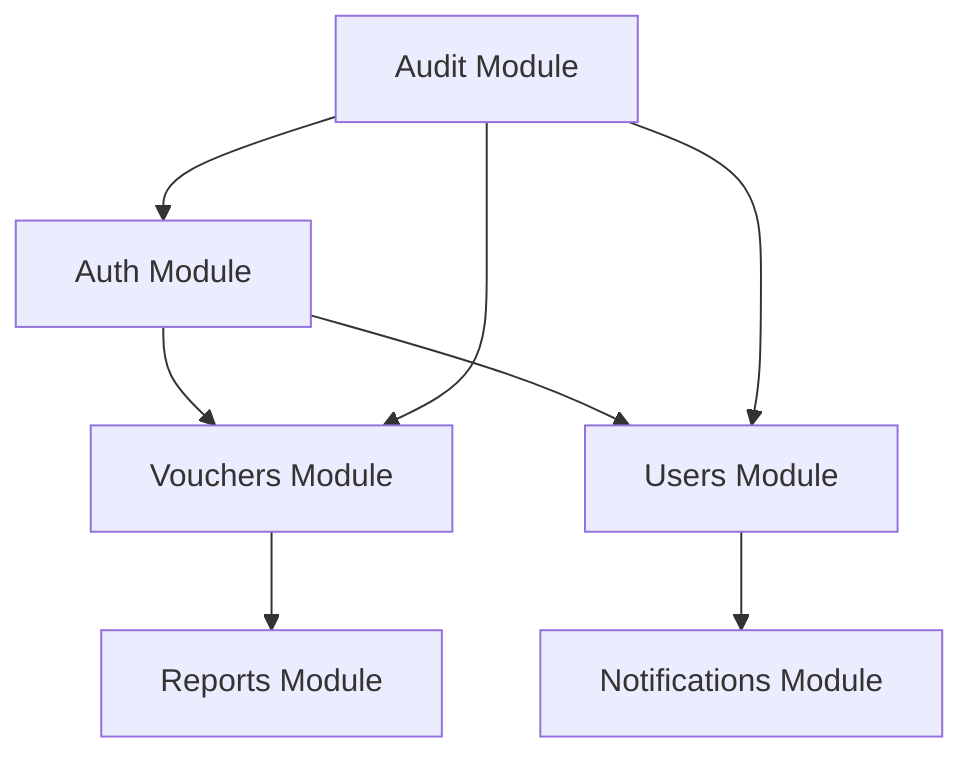

# 📦 Módulos - El Agave Backend

## 🎯 Descripción General

Esta sección contiene la documentación detallada de cada módulo del sistema. Cada módulo es una unidad funcional independiente que puede ser desarrollada, probada y desplegada por separado.

## 📋 Módulos Implementados

### 🔐 [Autenticación](./auth/README.md)
**Estado**: ✅ Implementado  
**Versión**: 1.0.0  
**Responsable**: Sistema de autenticación y autorización

**Características principales:**
- Registro e inicio de sesión de usuarios
- Autenticación OAuth con múltiples proveedores
- Gestión de tokens JWT
- Guards y decoradores de autenticación
- Integración con Supabase

**Endpoints principales:**
- `POST /auth/signup` - Registro de usuarios
- `POST /auth/signin` - Inicio de sesión
- `POST /auth/oauth/signin` - Autenticación OAuth
- `GET /auth/me` - Obtener usuario actual

---

### 💰 [Vouchers](./vouchers/README.md)
**Estado**: ✅ Implementado  
**Versión**: 1.0.0  
**Responsable**: Procesamiento de transacciones bancarias

**Características principales:**
- Carga y procesamiento de archivos (CSV, TXT, JSON)
- Validación robusta de transacciones
- Gestión completa de transacciones (CRUD)
- Exportación de datos
- Detección de duplicados y fraudes

**Endpoints principales:**
- `POST /vouchers/upload` - Cargar archivo de transacciones
- `GET /vouchers` - Listar transacciones
- `POST /vouchers` - Crear transacción
- `GET /vouchers/export/csv` - Exportar a CSV

---

## 🚧 Módulos en Desarrollo

### 👥 Users
**Estado**: 🚧 En desarrollo  
**Versión**: 0.1.0  
**Responsable**: Gestión de usuarios y perfiles

**Características planificadas:**
- Gestión de perfiles de usuario
- Roles y permisos
- Configuraciones de usuario
- Historial de actividades

---

### 📊 Reports
**Estado**: 📋 Planificado  
**Versión**: 0.0.0  
**Responsable**: Generación de reportes y analytics

**Características planificadas:**
- Reportes financieros
- Analytics de transacciones
- Dashboards personalizables
- Exportación de reportes

---

## 📋 Módulos Planificados

### 🔔 Notifications
**Estado**: 📋 Planificado  
**Responsable**: Sistema de notificaciones

### 🔍 Audit
**Estado**: 📋 Planificado  
**Responsable**: Logs de auditoría y trazabilidad

### 💳 Payments
**Estado**: 📋 Planificado  
**Responsable**: Integración con pasarelas de pago

### 📦 Inventory
**Estado**: 📋 Planificado  
**Responsable**: Gestión de inventario

### 🛒 Orders
**Estado**: 📋 Planificado  
**Responsable**: Gestión de pedidos

### 🚚 Shipping
**Estado**: 📋 Planificado  
**Responsable**: Gestión de envíos

---

## 📊 Estadísticas de Módulos

| Estado | Cantidad | Módulos |
|--------|----------|---------|
| ✅ Implementado | 2 | Auth, Vouchers |
| 🚧 En desarrollo | 1 | Users |
| 📋 Planificado | 6 | Reports, Notifications, Audit, Payments, Inventory, Orders, Shipping |

**Total de módulos**: 9

---

## 🏗️ Arquitectura de Módulos

### Estructura Estándar de un Módulo

```
src/[module-name]/
├── controllers/           # Controladores HTTP
├── services/             # Lógica de negocio
├── dto/                  # Data Transfer Objects
├── interfaces/           # Interfaces TypeScript
├── guards/               # Guards de autenticación/autorización
├── decorators/           # Decoradores personalizados
├── [module-name].module.ts
└── [module-name].service.ts
```

### Convenciones de Nomenclatura

- **Módulos**: `kebab-case` (ej: `user-management`)
- **Servicios**: `PascalCase` (ej: `UserService`)
- **Controladores**: `PascalCase` (ej: `UserController`)
- **DTOs**: `PascalCase` con sufijo `Dto` (ej: `CreateUserDto`)
- **Interfaces**: `PascalCase` (ej: `UserInterface`)

### Dependencias entre Módulos



---

## 🔄 Proceso de Desarrollo de Módulos

### 1. Planificación
- [ ] Definir requerimientos
- [ ] Diseñar arquitectura
- [ ] Crear documentación inicial

### 2. Implementación
- [ ] Crear estructura de carpetas
- [ ] Implementar servicios
- [ ] Crear controladores
- [ ] Definir DTOs e interfaces

### 3. Testing
- [ ] Pruebas unitarias
- [ ] Pruebas de integración
- [ ] Pruebas end-to-end

### 4. Documentación
- [ ] Actualizar README del módulo
- [ ] Documentar endpoints
- [ ] Crear ejemplos de uso

### 5. Despliegue
- [ ] Integración con módulos existentes
- [ ] Pruebas en staging
- [ ] Despliegue a producción

---

**Última actualización**: $(date)
**Versión**: 1.0.0
