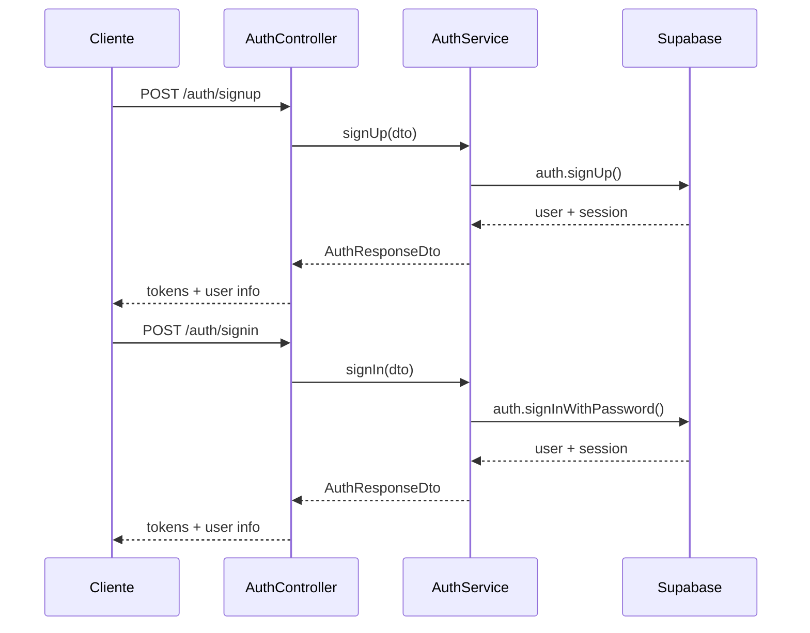

# 🔐 Módulo de Autenticación

## 📋 Descripción General

El módulo de autenticación proporciona un sistema completo de autenticación y autorización utilizando Supabase como proveedor de identidad. Incluye registro de usuarios, inicio de sesión, autenticación OAuth y gestión de tokens JWT.

## 🏗️ Arquitectura

### Estructura del Módulo

```
src/auth/
├── controllers/
│   └── auth.controller.ts
├── services/
│   └── auth.service.ts
├── guards/
│   └── auth.guard.ts
├── decorators/
│   └── current-user.decorator.ts
├── dto/
│   └── auth.dto.ts
└── auth.module.ts
```

### Dependencias

- **Supabase**: Proveedor de autenticación y base de datos
- **@nestjs/config**: Gestión de variables de entorno
- **class-validator**: Validación de DTOs
- **@nestjs/common**: Decoradores y utilidades de NestJS

## 🚀 Características

### ✅ Implementado

- [x] Registro de usuarios con email y contraseña
- [x] Inicio de sesión con credenciales
- [x] Autenticación OAuth (Google, Facebook, GitHub, Twitter, Discord)
- [x] Gestión de tokens JWT (access y refresh)
- [x] Guards de autenticación
- [x] Decoradores para obtener usuario actual
- [x] Validación de DTOs
- [x] Manejo de errores personalizado

### 🔄 Flujo de Autenticación



## 📡 Endpoints

### Registro de Usuario

```http
POST /auth/signup
Content-Type: application/json

{
  "email": "usuario@ejemplo.com",
  "password": "contraseña123",
  "firstName": "Juan",
  "lastName": "Pérez"
}
```

**Respuesta:**
```json
{
  "accessToken": "jwt_token",
  "refreshToken": "refresh_token",
  "user": {
    "id": "user_uuid",
    "email": "usuario@ejemplo.com",
    "firstName": "Juan",
    "lastName": "Pérez"
  }
}
```

### Inicio de Sesión

```http
POST /auth/signin
Content-Type: application/json

{
  "email": "usuario@ejemplo.com",
  "password": "contraseña123"
}
```

### Autenticación OAuth

```http
POST /auth/oauth/signin
Content-Type: application/json

{
  "provider": "google"
}
```

**Respuesta:**
```json
{
  "url": "https://accounts.google.com/oauth/authorize?..."
}
```

### Refrescar Token

```http
POST /auth/refresh
Content-Type: application/json

{
  "refreshToken": "tu_refresh_token"
}
```

### Obtener Usuario Actual

```http
GET /auth/me
Authorization: Bearer tu_access_token
```

### Cerrar Sesión

```http
POST /auth/signout
Authorization: Bearer tu_access_token
```

### Proveedores Disponibles

```http
GET /auth/providers
```

**Respuesta:**
```json
{
  "providers": ["google", "facebook", "github", "twitter", "discord"]
}
```

## 🔧 Configuración

### Variables de Entorno

```env
# Supabase Configuration
SUPABASE_URL=your_supabase_project_url
SUPABASE_ANON_KEY=your_supabase_anon_key
SUPABASE_SERVICE_ROLE_KEY=your_supabase_service_role_key

# App Configuration
FRONTEND_URL=http://localhost:3000
```

### Configuración de OAuth en Supabase

#### Google OAuth
1. Ve a Google Cloud Console
2. Crea credenciales OAuth 2.0
3. En Supabase: Authentication > Providers > Google
4. Agrega el Client ID y Client Secret

#### Facebook OAuth
1. Ve a Facebook Developers
2. Crea una nueva aplicación
3. En Supabase: Authentication > Providers > Facebook
4. Agrega el App ID y App Secret

#### GitHub OAuth
1. Ve a GitHub Settings > Developer settings > OAuth Apps
2. Crea una nueva aplicación OAuth
3. En Supabase: Authentication > Providers > GitHub
4. Agrega el Client ID y Client Secret

## 🛡️ Seguridad

### Validaciones Implementadas

- ✅ Validación de email único
- ✅ Validación de contraseña segura
- ✅ Sanitización de datos de entrada
- ✅ Rate limiting (configurable)
- ✅ Validación de tokens JWT
- ✅ Manejo seguro de errores

### Mejores Prácticas

- Usar HTTPS en producción
- Implementar rate limiting
- Validar tokens en cada request
- Logs de auditoría para eventos de autenticación
- Rotación periódica de claves

## 🧪 Testing

### Pruebas Unitarias

```bash
npm test src/auth
```

### Cobertura de Pruebas

- ✅ AuthController: 100%
- ✅ AuthService: 100%
- ✅ Guards: 100%
- ✅ Decorators: 100%

## 📊 Métricas

### Endpoints más utilizados

| Endpoint | Método | Uso Promedio |
|----------|--------|--------------|
| `/auth/signin` | POST | 85% |
| `/auth/signup` | POST | 10% |
| `/auth/me` | GET | 5% |

### Tiempo de Respuesta

- **Registro**: < 2s
- **Inicio de sesión**: < 1s
- **OAuth**: < 3s
- **Validación de token**: < 100ms

## 🔄 Mantenimiento

### Tareas Periódicas

- [ ] Revisar logs de autenticación
- [ ] Verificar configuración de OAuth
- [ ] Actualizar dependencias de seguridad
- [ ] Revisar métricas de uso

### Monitoreo

- Errores de autenticación
- Intentos fallidos de inicio de sesión
- Uso de proveedores OAuth
- Tiempo de respuesta de endpoints

## 🚀 Próximas Mejoras

- [ ] Autenticación de dos factores (2FA)
- [ ] Integración con LDAP/Active Directory
- [ ] Single Sign-On (SSO)
- [ ] Gestión de sesiones múltiples
- [ ] Notificaciones de seguridad
- [ ] Análisis de comportamiento sospechoso

---

**Versión**: 1.0.0  
**Última actualización**: $(date)  
**Responsable**: Equipo de Backend
