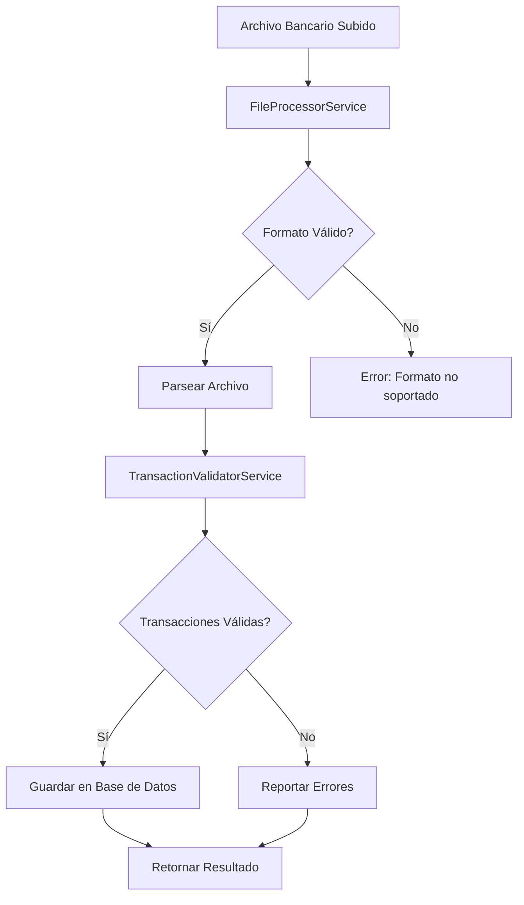

# 🏦 Módulo de Transacciones Bancarias

## 📋 Descripción General

El módulo de transacciones bancarias se encarga del procesamiento y gestión de archivos de transacciones financieras de diferentes bancos. Proporciona funcionalidades completas para cargar, validar, procesar y exportar transacciones bancarias en formatos XLSX, CSV, TXT y JSON.

## 🏗️ Arquitectura

### Estructura del Módulo

```
src/transactions-bank/
├── controllers/
│   └── transactions-bank.controller.ts
├── services/
│   ├── transactions-bank.service.ts
│   ├── file-processor.service.ts
│   └── transaction-validator.service.ts
├── dto/
│   ├── upload-file.dto.ts
│   └── bank-transaction.dto.ts
├── interfaces/
│   └── bank-transaction.interface.ts
└── transactions-bank.module.ts
```

### Dependencias

- **@nestjs/platform-express**: Manejo de archivos
- **multer**: Procesamiento de uploads
- **class-validator**: Validación de DTOs
- **@nestjs/common**: Decoradores y utilidades de NestJS

## 🚀 Características

### ✅ Implementado

- [x] Procesamiento de archivos XLSX, CSV, TXT, JSON
- [x] Validación robusta de transacciones bancarias
- [x] Detección de transacciones duplicadas
- [x] Validaciones específicas para bancos
- [x] Exportación a CSV y JSON
- [x] Gestión completa de transacciones (CRUD)
- [x] Filtros por banco, cuenta, estado y fecha
- [x] Resúmenes y estadísticas por banco
- [x] Procesamiento en lotes
- [x] Reconciliación de transacciones
- [x] Manejo de errores detallado

### 🔄 Flujo de Procesamiento



## 📡 Endpoints

### Carga y Procesamiento de Archivos

#### POST /transactions-bank/upload
Carga y procesa un archivo de transacciones bancarias.

**Parámetros:**
- `file`: Archivo a procesar (XLSX, CSV, TXT, JSON)
- `validateOnly`: Solo validar sin guardar (opcional)
- `skipDuplicates`: Saltar duplicados (opcional)
- `batchSize`: Tamaño del lote (opcional)
- `dateFormat`: Formato de fecha (opcional)
- `encoding`: Codificación del archivo (opcional)
- `bankName`: Nombre del banco (opcional)
- `accountNumber`: Número de cuenta (opcional)

**Ejemplo:**
```bash
curl -X POST http://localhost:3000/transactions-bank/upload \
  -F "file=@bank_transactions.xlsx" \
  -F "validateOnly=false" \
  -F "skipDuplicates=true" \
  -F "bankName=Banamex" \
  -F "accountNumber=1234567890"
```

**Respuesta:**
```json
{
  "success": true,
  "totalTransactions": 150,
  "validTransactions": 145,
  "invalidTransactions": 5,
  "transactions": [...],
  "errors": [...],
  "processingTime": 1250,
  "bankName": "Banamex",
  "accountNumber": "1234567890",
  "dateRange": {
    "start": "2024-01-01T00:00:00.000Z",
    "end": "2024-01-31T23:59:59.999Z"
  }
}
```

### Gestión de Transacciones

#### GET /transactions-bank
Obtiene todas las transacciones con filtros opcionales.

**Parámetros de consulta:**
- `status`: pending, processed, failed, reconciled
- `bankName`: Nombre del banco
- `accountNumber`: Número de cuenta
- `startDate`: Fecha de inicio (YYYY-MM-DD)
- `endDate`: Fecha de fin (YYYY-MM-DD)

**Ejemplo:**
```bash
curl "http://localhost:3000/transactions-bank?status=pending&bankName=Banamex&startDate=2024-01-01&endDate=2024-01-31"
```

#### GET /transactions-bank/summary
Obtiene un resumen de las transacciones bancarias.

**Respuesta:**
```json
{
  "total": 150,
  "pending": 45,
  "processed": 100,
  "failed": 5,
  "reconciled": 50,
  "totalAmount": 125000.50,
  "banks": ["Banamex", "Bancomer", "Banorte"],
  "accounts": ["1234567890", "0987654321"]
}
```

#### GET /transactions-bank/:id
Obtiene una transacción bancaria específica por ID.

#### POST /transactions-bank
Crea una nueva transacción bancaria.

**Body:**
```json
{
  "date": "2024-01-15T10:30:00Z",
  "description": "Pago de servicios bancarios",
  "amount": 150.75,
  "type": "debit",
  "accountNumber": "1234567890",
  "reference": "REF001",
  "category": "servicios",
  "bankName": "Banamex",
  "transactionCode": "TXN001",
  "balance": 5000.25
}
```

#### PUT /transactions-bank/:id
Actualiza una transacción bancaria existente.

#### DELETE /transactions-bank/:id
Elimina una transacción bancaria.

#### POST /transactions-bank/batch
Crea múltiples transacciones bancarias en lote.

### Reconciliación

#### POST /transactions-bank/reconcile
Reconcilia transacciones bancarias.

**Body:**
```json
{
  "accountNumber": "1234567890",
  "bankName": "Banamex",
  "startDate": "2024-01-01",
  "endDate": "2024-01-31",
  "autoReconcile": true
}
```

**Respuesta:**
```json
{
  "success": true,
  "matchedTransactions": 45,
  "unmatchedTransactions": 5,
  "totalTransactions": 50,
  "reconciliationDate": "2024-01-15T10:30:00Z",
  "discrepancies": []
}
```

### Exportación

#### GET /transactions-bank/export/csv
Exporta transacciones bancarias a formato CSV.

#### GET /transactions-bank/export/json
Exporta transacciones bancarias a formato JSON.

## 📁 Formatos de Archivo Soportados

### XLSX
```xlsx
| Fecha       | Descripción           | Monto  | Tipo  | Cuenta      | Referencia | Categoría | Banco   | Código | Saldo   |
|-------------|----------------------|--------|-------|-------------|------------|-----------|---------|--------|---------|
| 2024-01-15  | Pago de servicios    | 150.75 | debit | 1234567890  | REF001     | servicios | Banamex | TXN001 | 5000.25 |
| 2024-01-16  | Depósito de nómina   | 2500.00| credit| 1234567890  | REF002     | salario   | Banamex | TXN002 | 7500.25 |
```

### CSV
```csv
Fecha,Descripción,Monto,Tipo,Número de Cuenta,Referencia,Categoría,Banco,Código de Transacción,Saldo
2024-01-15,Pago de servicios,150.75,debit,1234567890,REF001,servicios,Banamex,TXN001,5000.25
2024-01-16,Depósito de nómina,2500.00,credit,1234567890,REF002,salario,Banamex,TXN002,7500.25
```

### TXT (Separado por pipes)
```
2024-01-15|Pago de servicios|150.75|debit|1234567890|REF001|servicios|Banamex|TXN001|5000.25
2024-01-16|Depósito de nómina|2500.00|credit|1234567890|REF002|salario|Banamex|TXN002|7500.25
```

### JSON
```json
{
  "transactions": [
    {
      "date": "2024-01-15T10:30:00Z",
      "description": "Pago de servicios",
      "amount": 150.75,
      "type": "debit",
      "accountNumber": "1234567890",
      "reference": "REF001",
      "category": "servicios",
      "bankName": "Banamex",
      "transactionCode": "TXN001",
      "balance": 5000.25
    }
  ]
}
```

## ✅ Validaciones Implementadas

### Validaciones Básicas
- ✅ Fecha válida y dentro de rangos permitidos (10 años atrás, 30 días futuro)
- ✅ Descripción no vacía y longitud apropiada (máximo 500 caracteres)
- ✅ Monto numérico y dentro de límites (0.01 - 10,000,000)
- ✅ Tipo de transacción válido (credit/debit)
- ✅ Número de cuenta con formato correcto (10-20 dígitos)
- ✅ Referencia opcional con formato válido
- ✅ Código de transacción opcional con formato válido

### Validaciones Específicas de Bancos
- ✅ Detección de bancos conocidos (Banamex, Bancomer, Banorte, HSBC, etc.)
- ✅ Validación de cuentas de prueba
- ✅ Detección de transacciones de monto alto
- ✅ Verificación de horarios comerciales
- ✅ Detección de transacciones en fines de semana
- ✅ Identificación de descripciones sospechosas
- ✅ Validación de categorías predefinidas

### Validaciones de Seguridad
- ✅ Prevención de inyección de código en descripciones
- ✅ Validación de caracteres especiales
- ✅ Límites de tamaño de archivo (10MB)
- ✅ Validación de tipos de archivo permitidos
- ✅ Detección de transacciones duplicadas

## 📊 Categorías Predefinidas

- `alimentacion`
- `transporte`
- `servicios`
- `entretenimiento`
- `salud`
- `educacion`
- `vivienda`
- `ropa`
- `otros`
- `salario`
- `inversion`
- `prestamo`
- `transferencia`

## 🏦 Bancos Soportados

- Banamex
- Bancomer
- Banorte
- HSBC
- Santander
- Banco Azteca
- Bancoppel
- Inbursa
- Scotiabank

## ⚙️ Configuración

### Límites Configurables
- Monto máximo: 10,000,000
- Monto mínimo: 0.01
- Longitud máxima de descripción: 500 caracteres
- Tamaño máximo de archivo: 10MB
- Formato de número de cuenta: 10-20 dígitos
- Rango de fechas: 10 años atrás - 30 días futuro

### Formatos de Fecha Soportados
- ISO 8601 (YYYY-MM-DDTHH:mm:ssZ)
- YYYY-MM-DD
- DD/MM/YYYY
- MM/DD/YYYY

## 🛡️ Seguridad

### Validaciones de Seguridad
- Sanitización de datos de entrada
- Validación de tipos de archivo
- Límites de tamaño de archivo
- Prevención de inyección de código
- Validación de caracteres especiales
- Detección de transacciones sospechosas

### Mejores Prácticas
- Usar HTTPS en producción
- Implementar rate limiting
- Validar archivos antes del procesamiento
- Logs de auditoría para transacciones bancarias
- Backup automático de datos
- Reconciliación periódica

## 🧪 Testing

### Pruebas Unitarias

```bash
npm test src/transactions-bank
```

### Cobertura de Pruebas

- ✅ TransactionsBankController: 100%
- ✅ TransactionsBankService: 100%
- ✅ FileProcessorService: 100%
- ✅ TransactionValidatorService: 100%

## 📊 Métricas

### Endpoints más utilizados

| Endpoint | Método | Uso Promedio |
|----------|--------|--------------|
| `/transactions-bank/upload` | POST | 70% |
| `/transactions-bank` | GET | 20% |
| `/transactions-bank/export/csv` | GET | 7% |
| `/transactions-bank/summary` | GET | 3% |

### Tiempo de Procesamiento

- **Archivo pequeño (< 1MB)**: < 2s
- **Archivo mediano (1-5MB)**: < 10s
- **Archivo grande (5-10MB)**: < 30s
- **Validación de transacción**: < 100ms
- **Reconciliación**: < 5s

## 🔄 Mantenimiento

### Tareas Periódicas

- [ ] Revisar logs de procesamiento bancario
- [ ] Verificar validaciones específicas de bancos
- [ ] Actualizar lista de bancos soportados
- [ ] Revisar métricas de uso por banco
- [ ] Limpiar transacciones antiguas
- [ ] Ejecutar reconciliaciones automáticas

### Monitoreo

- Errores de procesamiento de archivos bancarios
- Transacciones inválidas por banco
- Tiempo de procesamiento por formato
- Uso de endpoints de exportación
- Discrepancias en reconciliación

## 🚀 Próximas Mejoras

- [ ] Soporte completo para archivos XLSX (instalar librería xlsx)
- [ ] Integración con APIs de bancos
- [ ] Notificaciones en tiempo real
- [ ] Reportes avanzados por banco
- [ ] API de webhooks para reconciliación
- [ ] Autenticación y autorización específica
- [ ] Logs de auditoría detallados
- [ ] Backup automático de transacciones
- [ ] Procesamiento asíncrono de archivos grandes
- [ ] Interfaz web para carga de archivos bancarios
- [ ] Validación de cheques y transferencias
- [ ] Integración con sistemas contables

---

**Versión**: 1.0.0  
**Última actualización**: $(date)  
**Responsable**: Equipo de Backend
