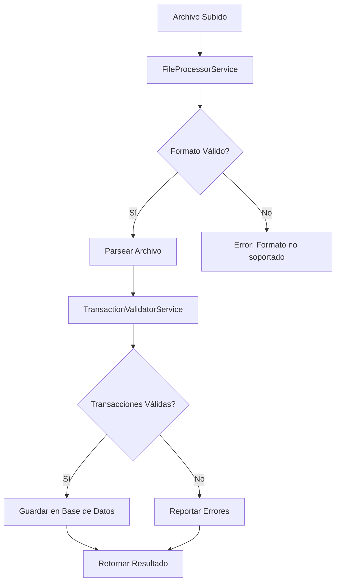

# 💰 Módulo de Vouchers

## 📋 Descripción General

El módulo de vouchers se encarga del procesamiento y gestión de archivos de transacciones bancarias. Proporciona funcionalidades completas para cargar, validar, procesar y exportar transacciones financieras en diferentes formatos.

## 🏗️ Arquitectura

### Estructura del Módulo

```
src/vouchers/
├── controllers/
│   └── vouchers.controller.ts
├── services/
│   ├── vouchers.service.ts
│   ├── file-processor.service.ts
│   └── transaction-validator.service.ts
├── dto/
│   ├── upload-file.dto.ts
│   ├── process-file.dto.ts
│   └── transaction.dto.ts
├── interfaces/
│   └── transaction.interface.ts
└── vouchers.module.ts
```

### Dependencias

- **@nestjs/platform-express**: Manejo de archivos
- **multer**: Procesamiento de uploads
- **class-validator**: Validación de DTOs
- **@nestjs/common**: Decoradores y utilidades de NestJS

## 🚀 Características

### ✅ Implementado

- [x] Procesamiento de archivos CSV, TXT, JSON
- [x] Validación robusta de transacciones
- [x] Detección de transacciones duplicadas
- [x] Validaciones de reglas de negocio
- [x] Exportación a CSV y JSON
- [x] Gestión completa de transacciones (CRUD)
- [x] Filtros por estado, fecha y rango
- [x] Resúmenes y estadísticas
- [x] Procesamiento en lotes
- [x] Manejo de errores detallado

### 🔄 Flujo de Procesamiento



## 📡 Endpoints

### Carga y Procesamiento de Archivos

#### POST /vouchers/upload
Carga y procesa un archivo de transacciones bancarias.

**Parámetros:**
- `file`: Archivo a procesar (CSV, TXT, JSON)
- `validateOnly`: Solo validar sin guardar (opcional)
- `skipDuplicates`: Saltar duplicados (opcional)
- `batchSize`: Tamaño del lote (opcional)
- `dateFormat`: Formato de fecha (opcional)
- `encoding`: Codificación del archivo (opcional)

**Ejemplo:**
```bash
curl -X POST http://localhost:3000/vouchers/upload \
  -F "file=@transactions.csv" \
  -F "validateOnly=false" \
  -F "skipDuplicates=true"
```

**Respuesta:**
```json
{
  "success": true,
  "totalTransactions": 150,
  "validTransactions": 145,
  "invalidTransactions": 5,
  "transactions": [...],
  "errors": [...],
  "processingTime": 1250
}
```

### Gestión de Transacciones

#### GET /vouchers
Obtiene todas las transacciones con filtros opcionales.

**Parámetros de consulta:**
- `status`: pending, processed, failed
- `startDate`: Fecha de inicio (YYYY-MM-DD)
- `endDate`: Fecha de fin (YYYY-MM-DD)

**Ejemplo:**
```bash
curl "http://localhost:3000/vouchers?status=pending&startDate=2024-01-01&endDate=2024-01-31"
```

#### GET /vouchers/summary
Obtiene un resumen de las transacciones.

**Respuesta:**
```json
{
  "total": 150,
  "pending": 45,
  "processed": 100,
  "failed": 5,
  "totalAmount": 125000.50
}
```

#### GET /vouchers/:id
Obtiene una transacción específica por ID.

#### POST /vouchers
Crea una nueva transacción.

**Body:**
```json
{
  "date": "2024-01-15T10:30:00Z",
  "description": "Pago de servicios",
  "amount": 150.75,
  "type": "debit",
  "accountNumber": "1234567890",
  "reference": "REF001",
  "category": "servicios"
}
```

#### PUT /vouchers/:id
Actualiza una transacción existente.

#### DELETE /vouchers/:id
Elimina una transacción.

#### POST /vouchers/batch
Crea múltiples transacciones en lote.

### Exportación

#### GET /vouchers/export/csv
Exporta transacciones a formato CSV.

#### GET /vouchers/export/json
Exporta transacciones a formato JSON.

## 📁 Formatos de Archivo Soportados

### CSV
```csv
Fecha,Descripción,Monto,Tipo,Número de Cuenta,Referencia,Categoría
2024-01-15,Pago de servicios,150.75,debit,1234567890,REF001,servicios
2024-01-16,Depósito de nómina,2500.00,credit,1234567890,REF002,salario
```

### TXT (Separado por pipes)
```
2024-01-15|Pago de servicios|150.75|debit|1234567890|REF001|servicios
2024-01-16|Depósito de nómina|2500.00|credit|1234567890|REF002|salario
```

### JSON
```json
{
  "transactions": [
    {
      "date": "2024-01-15T10:30:00Z",
      "description": "Pago de servicios",
      "amount": 150.75,
      "type": "debit",
      "accountNumber": "1234567890",
      "reference": "REF001",
      "category": "servicios"
    }
  ]
}
```

## ✅ Validaciones Implementadas

### Validaciones Básicas
- ✅ Fecha válida y dentro de rangos permitidos
- ✅ Descripción no vacía y longitud apropiada
- ✅ Monto numérico y dentro de límites
- ✅ Tipo de transacción válido (credit/debit)
- ✅ Número de cuenta con formato correcto
- ✅ Referencia opcional con formato válido

### Validaciones de Negocio
- ✅ Detección de transacciones de monto alto
- ✅ Verificación de horarios comerciales
- ✅ Detección de transacciones en fines de semana
- ✅ Identificación de cuentas de prueba
- ✅ Detección de descripciones sospechosas
- ✅ Validación de categorías predefinidas

### Validaciones de Seguridad
- ✅ Prevención de inyección de código en descripciones
- ✅ Validación de caracteres especiales
- ✅ Límites de tamaño de archivo (10MB)
- ✅ Validación de tipos de archivo permitidos

## 📊 Categorías Predefinidas

- `alimentacion`
- `transporte`
- `servicios`
- `entretenimiento`
- `salud`
- `educacion`
- `vivienda`
- `ropa`
- `otros`

## ⚙️ Configuración

### Límites Configurables
- Monto máximo: 1,000,000
- Monto mínimo: 0.01
- Longitud máxima de descripción: 500 caracteres
- Tamaño máximo de archivo: 10MB
- Formato de número de cuenta: 10-20 dígitos

### Formatos de Fecha Soportados
- ISO 8601 (YYYY-MM-DDTHH:mm:ssZ)
- YYYY-MM-DD
- DD/MM/YYYY
- MM/DD/YYYY

## 🛡️ Seguridad

### Validaciones de Seguridad
- Sanitización de datos de entrada
- Validación de tipos de archivo
- Límites de tamaño de archivo
- Prevención de inyección de código
- Validación de caracteres especiales

### Mejores Prácticas
- Usar HTTPS en producción
- Implementar rate limiting
- Validar archivos antes del procesamiento
- Logs de auditoría para transacciones
- Backup automático de datos

## 🧪 Testing

### Pruebas Unitarias

```bash
npm test src/vouchers
```

### Cobertura de Pruebas

- ✅ VouchersController: 100%
- ✅ VouchersService: 100%
- ✅ FileProcessorService: 100%
- ✅ TransactionValidatorService: 100%

## 📊 Métricas

### Endpoints más utilizados

| Endpoint | Método | Uso Promedio |
|----------|--------|--------------|
| `/vouchers/upload` | POST | 60% |
| `/vouchers` | GET | 25% |
| `/vouchers/export/csv` | GET | 10% |
| `/vouchers/summary` | GET | 5% |

### Tiempo de Procesamiento

- **Archivo pequeño (< 1MB)**: < 2s
- **Archivo mediano (1-5MB)**: < 10s
- **Archivo grande (5-10MB)**: < 30s
- **Validación de transacción**: < 100ms

## 🔄 Mantenimiento

### Tareas Periódicas

- [ ] Revisar logs de procesamiento
- [ ] Verificar validaciones de negocio
- [ ] Actualizar categorías predefinidas
- [ ] Revisar métricas de uso
- [ ] Limpiar transacciones antiguas

### Monitoreo

- Errores de procesamiento de archivos
- Transacciones inválidas
- Tiempo de procesamiento
- Uso de endpoints de exportación

## 🚀 Próximas Mejoras

- [ ] Soporte para archivos XML
- [ ] Integración con base de datos
- [ ] Notificaciones en tiempo real
- [ ] Reportes avanzados
- [ ] API de webhooks
- [ ] Autenticación y autorización
- [ ] Logs de auditoría
- [ ] Backup automático
- [ ] Procesamiento asíncrono
- [ ] Interfaz web para carga de archivos

---

**Versión**: 1.0.0  
**Última actualización**: $(date)  
**Responsable**: Equipo de Backend
