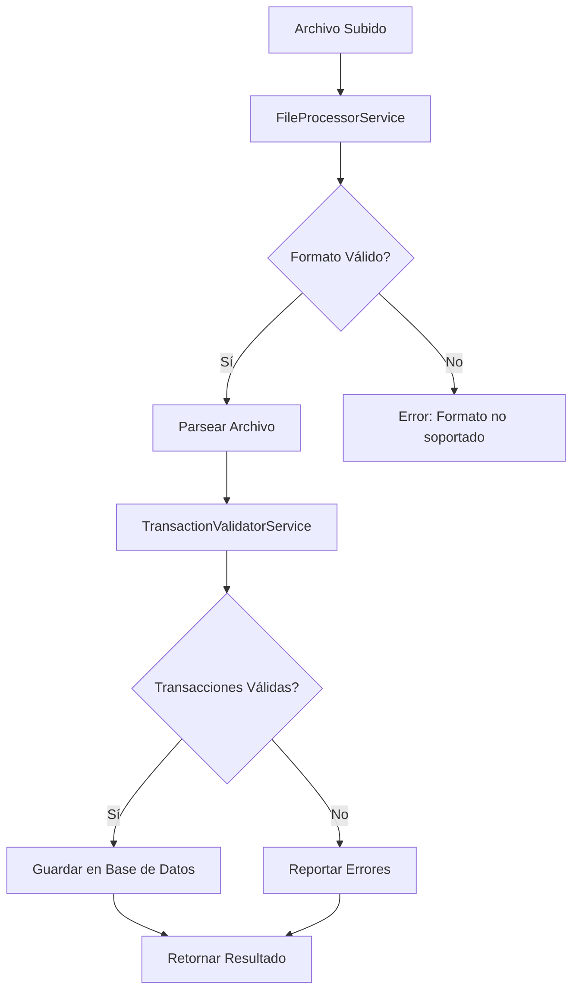
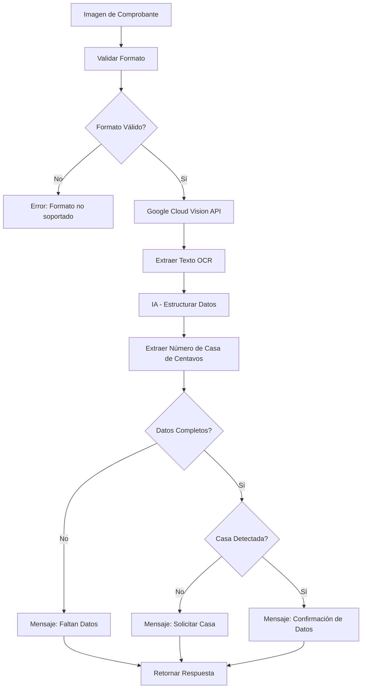
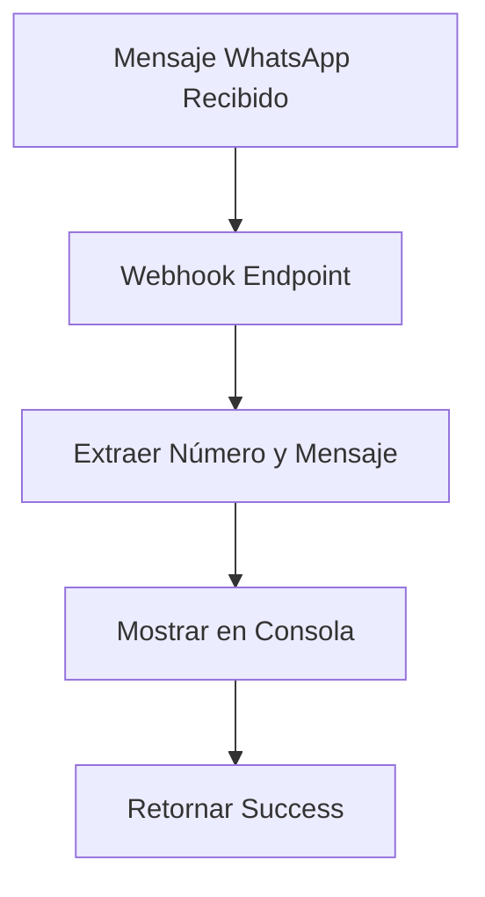

# 💰 Módulo de Vouchers

## 📋 Descripción General

El módulo de vouchers se encarga del procesamiento y gestión de comprobantes de pago mediante OCR (Reconocimiento Óptico de Caracteres) y la integración con WhatsApp para la recepción y procesamiento automatizado de comprobantes. Proporciona funcionalidades completas para cargar, validar, procesar y exportar transacciones financieras en diferentes formatos, además de extraer datos de imágenes de comprobantes usando Google Cloud Vision API.

## 🏗️ Arquitectura

### Estructura del Módulo

```
src/features/vouchers/
├── controllers/
│   └── vouchers.controller.ts
├── services/
│   ├── vouchers.service.ts
│   ├── ocr.service.ts
│   ├── file-processor.service.ts
│   └── transaction-validator.service.ts
├── dto/
│   ├── upload-file.dto.ts
│   ├── process-file.dto.ts
│   ├── transaction.dto.ts
│   └── ocr-service.dto.ts
├── interfaces/
│   └── transaction.interface.ts
└── vouchers.module.ts
```

### Dependencias

- **@nestjs/platform-express**: Manejo de archivos
- **multer**: Procesamiento de uploads
- **class-validator**: Validación de DTOs
- **@nestjs/common**: Decoradores y utilidades de NestJS
- **Google Cloud Vision API**: OCR y análisis de imágenes
- **Google Cloud Translate API**: Traducción de textos
- **OpenAI/Vertex AI**: Procesamiento de datos estructurados con IA

## 🚀 Características

### ✅ Implementado

- [x] Procesamiento de archivos CSV, TXT, JSON, XML
- [x] Procesamiento OCR de imágenes de comprobantes (JPG, PNG, PDF, etc.)
- [x] Extracción automática de datos de comprobantes (monto, fecha, referencia, hora)
- [x] Detección automática del número de casa desde centavos del monto
- [x] Integración con WhatsApp API para recepción de mensajes
- [x] Webhook de verificación para WhatsApp
- [x] Webhook de procesamiento de mensajes WhatsApp
- [x] Generación de mensajes de respuesta para WhatsApp según casos
- [x] Validación robusta de transacciones
- [x] Detección de transacciones duplicadas
- [x] Validaciones de reglas de negocio
- [x] Exportación a CSV y JSON
- [x] Gestión completa de transacciones (CRUD)
- [x] Filtros por estado, fecha y rango
- [x] Resúmenes y estadísticas
- [x] Procesamiento en lotes
- [x] Manejo de errores detallado
- [x] Verificación de estado de servicios de Google Cloud

### 🔄 Flujo de Procesamiento

#### Flujo de Procesamiento de Archivos

```mermaid
flowchart TD
    A[Archivo Subido] --> B[FileProcessorService]
    B --> C{Formato Válido?}
    C -->|Sí| D[Parsear Archivo]
    C -->|No| E[Error: Formato no soportado]
    D --> F[TransactionValidatorService]
    F --> G{Transacciones Válidas?}
    G -->|Sí| H[Guardar en Base de Datos]
    G -->|No| I[Reportar Errores]
    H --> J[Retornar Resultado]
    I --> J
```

#### Flujo de Procesamiento OCR

```mermaid
flowchart TD
    A[Imagen de Comprobante] --> B[Validar Formato]
    B --> C{Formato Válido?}
    C -->|No| D[Error: Formato no soportado]
    C -->|Sí| E[Google Cloud Vision API]
    E --> F[Extraer Texto OCR]
    F --> G[IA - Estructurar Datos]
    G --> H[Extraer Número de Casa de Centavos]
    H --> I{Datos Completos?}
    I -->|No| J[Mensaje: Faltan Datos]
    I -->|Sí| K{Casa Detectada?}
    K -->|No| L[Mensaje: Solicitar Casa]
    K -->|Sí| M[Mensaje: Confirmación de Datos]
    J --> N[Retornar Respuesta]
    L --> N
    M --> N
```

#### Flujo de Webhook WhatsApp

```mermaid
flowchart TD
    A[Mensaje WhatsApp Recibido] --> B[Webhook Endpoint]
    B --> C[Extraer Número y Mensaje]
    C --> D[Mostrar en Consola]
    D --> E[Retornar Success]
```

## 📡 Endpoints

### Carga y Procesamiento de Archivos

#### POST /vouchers/upload
Carga y procesa un archivo de transacciones bancarias.

**Parámetros:**
- `file`: Archivo a procesar (CSV, TXT, JSON, XML)
- `validateOnly`: Solo validar sin guardar (opcional)
- `skipDuplicates`: Saltar duplicados (opcional)
- `batchSize`: Tamaño del lote (opcional)
- `dateFormat`: Formato de fecha (opcional)
- `encoding`: Codificación del archivo (opcional)

**Ejemplo:**
```bash
curl -X POST http://localhost:3000/vouchers/upload \
  -F "file=@transactions.csv" \
  -F "validateOnly=false" \
  -F "skipDuplicates=true"
```

**Respuesta:**
```json
{
  "success": true,
  "totalTransactions": 150,
  "validTransactions": 145,
  "invalidTransactions": 5,
  "transactions": [...],
  "errors": [...],
  "processingTime": 1250
}
```

### Procesamiento OCR de Comprobantes

#### POST /vouchers/ocr-service
Procesa una imagen de comprobante usando OCR y extrae datos estructurados.

**Parámetros:**
- `file`: Imagen del comprobante (JPG, JPEG, PNG, GIF, BMP, WEBP, TIFF, PDF)
- `language`: Código de idioma para OCR (opcional, default: 'es')

**Límites:**
- Tamaño máximo: 10MB
- Formatos soportados: JPG, JPEG, PNG, GIF, BMP, WEBP, TIFF, PDF

**Ejemplo:**
```bash
curl -X POST http://localhost:3000/vouchers/ocr-service \
  -F "file=@comprobante.jpg" \
  -F "language=es"
```

**Respuesta:**
```json
{
  "rawText": "Texto extraído del comprobante...",
  "structuredData": {
    "monto": "1500.25",
    "fecha_pago": "2024-01-15",
    "referencia": "123456789",
    "hora_transaccion": "14:30:00",
    "casa": 25,
    "faltan_datos": false
  },
  "whatsappMessage": "Voy a registrar tu pago con el estatus \"pendiente verificación en banco\" con los siguientes datos que he encontrado en el comprobante:\nMonto de pago: 1500.25\nFecha de Pago: 2024-01-15\nNumero de Casa: 25\nReferencia: 123456789\nHora de Transacción: 14:30:00\n\nSi los datos son correctos, escribe SI"
}
```

**Casos de Respuesta WhatsApp:**

1. **Datos completos con casa detectada** (faltan_datos=false, casa=número):
```
Voy a registrar tu pago con el estatus "pendiente verificación en banco" con los siguientes datos...
```

2. **Datos completos sin casa** (faltan_datos=false, casa=null):
```
Para poder registrar tu pago por favor indica el número de casa a la que corresponde el pago: (El valor debe ser entre 1 y 66).
```

3. **Faltan datos** (faltan_datos=true):
```
No pude extraer los siguientes datos del comprobante que enviaste. Por favor indícame los valores correctos para los siguientes conceptos:
[pregunta con datos faltantes]
```

#### GET /vouchers/ocr-service/status
Verifica el estado de configuración de Google Cloud Services.

**Respuesta:**
```json
{
  "isConfigured": true,
  "services": {
    "vision": true,
    "storage": true,
    "translate": true,
    "textToSpeech": true,
    "speech": true
  },
  "projectId": "my-project-id",
  "message": "Google Cloud está configurado y funcionando correctamente"
}
```

### Gestión de Transacciones

#### GET /vouchers
Obtiene todas las transacciones con filtros opcionales.

**Parámetros de consulta:**
- `status`: pending, processed, failed
- `startDate`: Fecha de inicio (YYYY-MM-DD)
- `endDate`: Fecha de fin (YYYY-MM-DD)

**Ejemplo:**
```bash
curl "http://localhost:3000/vouchers?status=pending&startDate=2024-01-01&endDate=2024-01-31"
```

#### GET /vouchers/summary
Obtiene un resumen de las transacciones.

**Respuesta:**
```json
{
  "total": 150,
  "pending": 45,
  "processed": 100,
  "failed": 5,
  "totalAmount": 125000.50
}
```

#### GET /vouchers/:id
Obtiene una transacción específica por ID.

#### POST /vouchers
Crea una nueva transacción.

**Body:**
```json
{
  "date": "2024-01-15T10:30:00Z",
  "description": "Pago de servicios",
  "amount": 150.75,
  "type": "debit",
  "accountNumber": "1234567890",
  "reference": "REF001",
  "category": "servicios"
}
```

#### PUT /vouchers/:id
Actualiza una transacción existente.

#### DELETE /vouchers/:id
Elimina una transacción.

#### POST /vouchers/batch
Crea múltiples transacciones en lote.

### Integración WhatsApp

#### GET /vouchers/webhook/whatsapp
Verifica el webhook de WhatsApp (usado por Meta para validar el endpoint).

**Parámetros de consulta:**
- `hub.mode`: Modo de suscripción (debe ser 'subscribe')
- `hub.challenge`: Código de desafío enviado por WhatsApp
- `hub.verify_token`: Token de verificación configurado

**Variables de entorno requeridas:**
- `ACCESS_TOKEN_VERIFY_WA`: Token de verificación de WhatsApp

**Ejemplo:**
```bash
curl "http://localhost:3000/vouchers/webhook/whatsapp?hub.mode=subscribe&hub.challenge=CHALLENGE_TOKEN&hub.verify_token=YOUR_VERIFY_TOKEN"
```

**Respuesta exitosa:**
```
CHALLENGE_TOKEN
```

**Errores:**
- `401 Unauthorized`: Token de verificación inválido o no configurado

#### POST /vouchers/webhook/whatsapp
Recibe mensajes entrantes desde WhatsApp Business API.

**Descripción:**
Este endpoint procesa los webhooks enviados por WhatsApp cuando un usuario envía un mensaje. Extrae el número de teléfono del remitente y el contenido del mensaje, mostrándolos en consola para debugging y procesamiento posterior.

**Body (estructura de WhatsApp webhook):**
```json
{
  "entry": [{
    "changes": [{
      "value": {
        "messages": [{
          "from": "521234567890",
          "text": {
            "body": "Hola, quiero registrar mi pago"
          }
        }]
      }
    }]
  }]
}
```

**Respuesta:**
```json
{
  "success": true
}
```

**Consola (log):**
```
Número de WhatsApp: 521234567890
Mensaje recibido: Hola, quiero registrar mi pago
```

### Exportación

#### GET /vouchers/export/csv
Exporta transacciones a formato CSV.

#### GET /vouchers/export/json
Exporta transacciones a formato JSON.

## 📁 Formatos de Archivo Soportados

### Archivos de Transacciones

#### CSV
```csv
Fecha,Descripción,Monto,Tipo,Número de Cuenta,Referencia,Categoría
2024-01-15,Pago de servicios,150.75,debit,1234567890,REF001,servicios
2024-01-16,Depósito de nómina,2500.00,credit,1234567890,REF002,salario
```

#### TXT (Separado por pipes)
```
2024-01-15|Pago de servicios|150.75|debit|1234567890|REF001|servicios
2024-01-16|Depósito de nómina|2500.00|credit|1234567890|REF002|salario
```

#### JSON
```json
{
  "transactions": [
    {
      "date": "2024-01-15T10:30:00Z",
      "description": "Pago de servicios",
      "amount": 150.75,
      "type": "debit",
      "accountNumber": "1234567890",
      "reference": "REF001",
      "category": "servicios"
    }
  ]
}
```

### Imágenes de Comprobantes (OCR)

Formatos soportados para procesamiento OCR:
- **JPG/JPEG**: Imágenes fotográficas de comprobantes
- **PNG**: Imágenes con transparencia o capturas de pantalla
- **GIF**: Imágenes animadas o estáticas
- **BMP**: Mapas de bits sin comprimir
- **WEBP**: Formato de imagen moderno
- **TIFF**: Imágenes de alta calidad
- **PDF**: Documentos PDF con comprobantes

**Límite de tamaño:** 10MB por archivo

**Datos extraídos automáticamente:**
- Monto de la transacción
- Fecha de pago
- Referencia bancaria
- Hora de la transacción
- Número de casa (desde centavos del monto)

## ✅ Validaciones Implementadas

### Validaciones Básicas
- ✅ Fecha válida y dentro de rangos permitidos
- ✅ Descripción no vacía y longitud apropiada
- ✅ Monto numérico y dentro de límites
- ✅ Tipo de transacción válido (credit/debit)
- ✅ Número de cuenta con formato correcto
- ✅ Referencia opcional con formato válido

### Validaciones de Negocio
- ✅ Detección de transacciones de monto alto
- ✅ Verificación de horarios comerciales
- ✅ Detección de transacciones en fines de semana
- ✅ Identificación de cuentas de prueba
- ✅ Detección de descripciones sospechosas
- ✅ Validación de categorías predefinidas

### Validaciones de Seguridad
- ✅ Prevención de inyección de código en descripciones
- ✅ Validación de caracteres especiales
- ✅ Límites de tamaño de archivo (10MB)
- ✅ Validación de tipos de archivo permitidos

## 📊 Categorías Predefinidas

- `alimentacion`
- `transporte`
- `servicios`
- `entretenimiento`
- `salud`
- `educacion`
- `vivienda`
- `ropa`
- `otros`

## ⚙️ Configuración

### Límites Configurables
- Monto máximo: 1,000,000
- Monto mínimo: 0.01
- Longitud máxima de descripción: 500 caracteres
- Tamaño máximo de archivo: 10MB
- Formato de número de cuenta: 10-20 dígitos

### Formatos de Fecha Soportados
- ISO 8601 (YYYY-MM-DDTHH:mm:ssZ)
- YYYY-MM-DD
- DD/MM/YYYY
- MM/DD/YYYY

## 🛡️ Seguridad

### Validaciones de Seguridad
- Sanitización de datos de entrada
- Validación de tipos de archivo
- Límites de tamaño de archivo
- Prevención de inyección de código
- Validación de caracteres especiales

### Mejores Prácticas
- Usar HTTPS en producción
- Implementar rate limiting
- Validar archivos antes del procesamiento
- Logs de auditoría para transacciones
- Backup automático de datos

## 🧪 Testing

### Pruebas Unitarias

```bash
npm test src/vouchers
```

### Cobertura de Pruebas

- ✅ VouchersController: 100%
- ✅ VouchersService: 100%
- ✅ FileProcessorService: 100%
- ✅ TransactionValidatorService: 100%

## 📊 Métricas

### Endpoints más utilizados

| Endpoint | Método | Uso Promedio |
|----------|--------|--------------|
| `/vouchers/upload` | POST | 60% |
| `/vouchers` | GET | 25% |
| `/vouchers/export/csv` | GET | 10% |
| `/vouchers/summary` | GET | 5% |

### Tiempo de Procesamiento

- **Archivo pequeño (< 1MB)**: < 2s
- **Archivo mediano (1-5MB)**: < 10s
- **Archivo grande (5-10MB)**: < 30s
- **Validación de transacción**: < 100ms

## 🔄 Mantenimiento

### Tareas Periódicas

- [ ] Revisar logs de procesamiento
- [ ] Verificar validaciones de negocio
- [ ] Actualizar categorías predefinidas
- [ ] Revisar métricas de uso
- [ ] Limpiar transacciones antiguas

### Monitoreo

- Errores de procesamiento de archivos
- Transacciones inválidas
- Tiempo de procesamiento
- Uso de endpoints de exportación

## 🚀 Próximas Mejoras

- [ ] Soporte para archivos XML
- [ ] Integración con base de datos
- [ ] Notificaciones en tiempo real
- [ ] Reportes avanzados
- [ ] API de webhooks
- [ ] Autenticación y autorización
- [ ] Logs de auditoría
- [ ] Backup automático
- [ ] Procesamiento asíncrono
- [ ] Interfaz web para carga de archivos

---

**Versión**: 1.0.0  
**Última actualización**: $(date)  
**Responsable**: Equipo de Backend
